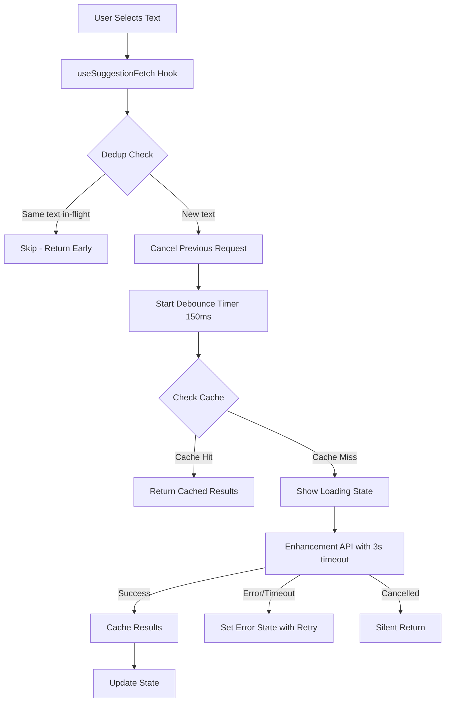

# Design Document

## Overview

This design addresses the bugs and issues in the AI suggestions workflow, focusing on request management (cancellation, deduplication, debouncing), error handling, caching, and UX improvements. The design follows the existing codebase patterns and integrates with the current architecture.

## Architecture

The solution modifies the existing suggestion fetching flow by introducing:

1. **Request Manager**: A utility class that handles cancellation, debouncing, and deduplication
2. **Client-side Cache**: A simple in-memory cache with TTL for suggestion results
3. **Enhanced Error States**: Proper error propagation with retry capability



## Components and Interfaces

### 1. SuggestionRequestManager

A new utility class to manage request lifecycle. Key design decisions:
- **Deduplication key** is separate from **cancellation token** to allow proper dedup checking
- **Cancellation throws** `CancellationError` consistently (no null returns)
- **cancelCurrentRequest()** also clears any pending debounce timer

```typescript
interface RequestManagerConfig {
  debounceMs: number;      // Default: 150
  timeoutMs: number;       // Default: 3000
}

interface RequestState {
  currentDedupKey: string | null;      // For deduplication (e.g., highlighted text)
  abortController: AbortController | null;
  debounceTimer: ReturnType<typeof setTimeout> | null;
}

class SuggestionRequestManager {
  private state: RequestState;
  private config: RequestManagerConfig;

  constructor(config?: Partial<RequestManagerConfig>);
  
  /**
   * Cancel any in-flight request AND clear pending debounce timer.
   * Safe to call multiple times.
   */
  cancelCurrentRequest(): void {
    if (this.state.debounceTimer) {
      clearTimeout(this.state.debounceTimer);
      this.state.debounceTimer = null;
    }
    if (this.state.abortController) {
      this.state.abortController.abort();
      this.state.abortController = null;
    }
    this.state.currentDedupKey = null;
  }
  
  /**
   * Schedule a new request with debouncing.
   * @param dedupKey - Key for deduplication (e.g., highlighted text)
   * @param requestFn - Function that performs the actual fetch
   * @throws CancellationError if request is cancelled
   * @throws Error for network/timeout errors
   */
  scheduleRequest<T>(
    dedupKey: string,
    requestFn: (signal: AbortSignal) => Promise<T>
  ): Promise<T>;
  
  /**
   * Check if a request with this dedup key is currently in-flight.
   */
  isRequestInFlight(dedupKey: string): boolean {
    return this.state.currentDedupKey === dedupKey && 
           this.state.abortController !== null;
  }
  
  /**
   * Cleanup on unmount - cancels everything.
   */
  dispose(): void {
    this.cancelCurrentRequest();
  }
}
```

**Location**: `client/src/features/prompt-optimizer/utils/SuggestionRequestManager.ts`

### 2. SuggestionCache

A simple cache utility for storing suggestion results.

```typescript
interface CacheEntry<T> {
  data: T;
  timestamp: number;
}

interface CacheConfig {
  ttlMs: number;           // Default: 300000 (5 minutes)
  maxEntries: number;      // Default: 50
}

class SuggestionCache<T> {
  private cache: Map<string, CacheEntry<T>>;
  private config: CacheConfig;

  constructor(config?: Partial<CacheConfig>);
  
  /**
   * Generate cache key from components.
   * Key includes: text + context window + prompt hash
   */
  static generateKey(
    highlightedText: string,
    contextBefore: string,  // Last 100 chars before selection
    contextAfter: string,   // First 100 chars after selection
    promptHash: string      // Simple hash of full prompt
  ): string {
    return `${highlightedText}|${contextBefore}|${contextAfter}|${promptHash}`;
  }
  
  get(key: string): T | null;
  set(key: string, value: T): void;
  clear(): void;
  prune(): void;
}

/**
 * Simple fast hash function for prompt.
 * Collision-tolerant: collisions just cause cache misses, not bugs.
 */
export function simpleHash(str: string): string {
  return `${str.length}_${str.slice(0, 50)}`;
}
```

**Location**: `client/src/features/prompt-optimizer/utils/SuggestionCache.ts`

### 3. Signal Utilities

Utility functions for combining abort signals.

```typescript
// utils/signalUtils.ts

/**
 * Custom error class for request cancellation.
 * Allows distinguishing cancellation from other errors.
 */
export class CancellationError extends Error {
  readonly isCancellation = true;
  constructor(message: string = 'Request cancelled') {
    super(message);
    this.name = 'CancellationError';
  }
}

/**
 * Combine multiple AbortSignals into one.
 * The combined signal aborts when ANY input signal aborts.
 */
export function combineSignals(...signals: AbortSignal[]): AbortSignal {
  const controller = new AbortController();
  
  for (const signal of signals) {
    if (signal.aborted) {
      controller.abort(signal.reason);
      return controller.signal;
    }
    signal.addEventListener(
      'abort', 
      () => controller.abort(signal.reason), 
      { once: true }
    );
  }
  
  return controller.signal;
}
```

**Location**: `client/src/features/prompt-optimizer/utils/signalUtils.ts`

### 4. Enhanced API Functions

Update the existing API functions to support cancellation and timeout.

```typescript
// enhancementSuggestionsApi.ts
import { CancellationError, combineSignals } from '../utils/signalUtils';
import { simpleHash } from '../utils/SuggestionCache';

interface FetchEnhancementSuggestionsParams {
  highlightedText: string;
  normalizedPrompt: string;
  inputPrompt: string;
  brainstormContext?: unknown | null;
  metadata?: { 
    startIndex?: number;  // Selection start position in prompt
    category?: string; 
    confidence?: number; 
    quote?: string;
  } | null;
  allLabeledSpans?: unknown[];
  nearbySpans?: unknown[];
  editHistory?: unknown[];
  signal?: AbortSignal;  // For external cancellation
}

const SUGGESTION_TIMEOUT_MS = 3000;

async function fetchEnhancementSuggestions(
  params: FetchEnhancementSuggestionsParams
): Promise<EnhancementSuggestionsResponse> {
  // Create timeout controller
  const timeoutController = new AbortController();
  const timeoutId = setTimeout(
    () => timeoutController.abort(new Error('Request timeout')), 
    SUGGESTION_TIMEOUT_MS
  );
  
  // Combine external signal with timeout signal
  const signal = params.signal 
    ? combineSignals(params.signal, timeoutController.signal)
    : timeoutController.signal;
  
  try {
    const response = await fetch('/api/get-enhancement-suggestions', {
      method: 'POST',
      headers: {
        'Content-Type': 'application/json',
        'X-API-Key': API_CONFIG.apiKey,
      },
      body: JSON.stringify({
        highlightedText: params.highlightedText,
        contextBefore: extractContextBefore(params),
        contextAfter: extractContextAfter(params),
        fullPrompt: params.normalizedPrompt,
        originalUserPrompt: params.inputPrompt,
        // ... other fields
      }),
      signal,
    });
    
    clearTimeout(timeoutId);
    
    if (!response.ok) {
      throw new Error(`Failed to fetch suggestions: ${response.status}`);
    }
    
    return await response.json();
    
  } catch (error: any) {
    clearTimeout(timeoutId);
    
    // Convert AbortError to CancellationError for consistent handling
    if (error.name === 'AbortError') {
      throw new CancellationError('Request cancelled or timed out');
    }
    
    throw error;
  }
}

/**
 * Extract context before the selection.
 * Uses metadata.startIndex if available, otherwise finds position.
 */
function extractContextBefore(params: FetchEnhancementSuggestionsParams): string {
  const { normalizedPrompt, highlightedText, metadata } = params;
  
  // Prefer explicit startIndex from metadata (more reliable)
  let startIndex = metadata?.startIndex;
  
  // Fallback: find position in prompt
  if (startIndex === undefined) {
    startIndex = normalizedPrompt.indexOf(highlightedText);
    if (startIndex === -1) {
      console.warn('[EnhancementApi] Could not locate highlight in prompt');
      startIndex = 0;
    }
  }
  
  // Extract up to 100 chars before selection
  return normalizedPrompt.slice(Math.max(0, startIndex - 100), startIndex);
}

/**
 * Extract context after the selection.
 */
function extractContextAfter(params: FetchEnhancementSuggestionsParams): string {
  const { normalizedPrompt, highlightedText, metadata } = params;
  
  let startIndex = metadata?.startIndex;
  if (startIndex === undefined) {
    startIndex = normalizedPrompt.indexOf(highlightedText);
    if (startIndex === -1) startIndex = 0;
  }
  
  const endIndex = startIndex + highlightedText.length;
  return normalizedPrompt.slice(endIndex, endIndex + 100);
}
```

### 5. Updated useSuggestionFetch Hook

```typescript
// useSuggestionFetch.ts
import { SuggestionRequestManager } from '../utils/SuggestionRequestManager';
import { SuggestionCache, simpleHash } from '../utils/SuggestionCache';
import { CancellationError } from '../utils/signalUtils';

export function useSuggestionFetch({
  promptOptimizer,
  selectedMode,
  suggestionsData,
  setSuggestionsData,
  stablePromptContext,
  toast,
  handleSuggestionClick,
}: UseSuggestionFetchParams) {
  const { getEditSummary } = useEditHistory();
  
  // Request manager instance (persists across renders)
  const requestManagerRef = useRef<SuggestionRequestManager>(
    new SuggestionRequestManager({ debounceMs: 150, timeoutMs: 3000 })
  );
  
  // Cache instance
  const cacheRef = useRef<SuggestionCache<EnhancementSuggestionsResponse>>(
    new SuggestionCache({ ttlMs: 300000, maxEntries: 50 })
  );
  
  // Store latest payload for retry functionality
  const lastPayloadRef = useRef<FetchPayload | null>(null);
  
  // Cleanup on unmount
  useEffect(() => {
    return () => {
      requestManagerRef.current.dispose();
    };
  }, []);

  const fetchEnhancementSuggestions = useCallback(
    async (payload: FetchPayload = {}): Promise<void> => {
      const trimmedHighlight = (payload.highlightedText || '').trim();
      const rawPrompt = payload.displayedPrompt ?? promptOptimizer.displayedPrompt ?? '';
      const normalizedPrompt = rawPrompt.normalize('NFC');
      
      // Early returns
      if (selectedMode !== 'video' || !trimmedHighlight) {
        return;
      }
      
      // Store payload for retry
      lastPayloadRef.current = payload;
      
      // DEDUPLICATION: Use highlighted text as dedup key
      const dedupKey = trimmedHighlight;
      
      // Check if same request is already in-flight
      if (requestManagerRef.current.isRequestInFlight(dedupKey)) {
        return; // Skip duplicate
      }
      
      // Cancel any previous request (different text)
      requestManagerRef.current.cancelCurrentRequest();
      
      // Get selection position from metadata or find it
      const startIndex = payload.metadata?.startIndex ?? 
        normalizedPrompt.indexOf(trimmedHighlight);
      const safeStartIndex = startIndex === -1 ? 0 : startIndex;
      
      // Check cache BEFORE showing loading state
      const cacheKey = SuggestionCache.generateKey(
        trimmedHighlight,
        normalizedPrompt.slice(Math.max(0, safeStartIndex - 100), safeStartIndex),
        normalizedPrompt.slice(
          safeStartIndex + trimmedHighlight.length, 
          safeStartIndex + trimmedHighlight.length + 100
        ),
        simpleHash(normalizedPrompt)
      );
      
      const cached = cacheRef.current.get(cacheKey);
      if (cached) {
        setSuggestionsData((prev) => ({
          ...prev,
          show: true,
          selectedText: trimmedHighlight,
          suggestions: cached.suggestions.map(s => typeof s === 'string' ? { text: s } : s),
          isLoading: false,
          isError: false,
          isPlaceholder: cached.isPlaceholder,
        }));
        return;
      }
      
      // Retry function for error state
      const retryFn = () => fetchEnhancementSuggestions(payload);
      
      // Schedule debounced request
      // NOTE: Loading state is shown AFTER debounce fires (inside scheduleRequest)
      try {
        const result = await requestManagerRef.current.scheduleRequest(
          dedupKey,
          async (signal) => {
            // Show loading state when request actually fires (after debounce)
            setSuggestionsData((prev) => ({
              ...prev,
              show: true,
              selectedText: trimmedHighlight,
              isLoading: true,
              isError: false,
              errorMessage: null,
              onRetry: retryFn,
            }));
            
            return fetchSuggestionsAPI({
              highlightedText: trimmedHighlight,
              normalizedPrompt,
              inputPrompt: promptOptimizer.inputPrompt,
              brainstormContext: stablePromptContext ?? null,
              metadata: { 
                ...payload.metadata, 
                startIndex: safeStartIndex 
              },
              allLabeledSpans: payload.allLabeledSpans,
              editHistory: getEditSummary(10),
              signal,
            });
          }
        );
        
        // Cache the result
        cacheRef.current.set(cacheKey, result);
        
        // Update state with results
        setSuggestionsData((prev) => ({
          ...prev,
          suggestions: result.suggestions.map(s => typeof s === 'string' ? { text: s } : s),
          isLoading: false,
          isError: false,
          isPlaceholder: result.isPlaceholder,
          onRetry: retryFn,
        }));
        
      } catch (error) {
        // Silently ignore cancellation - don't update state
        if (error instanceof CancellationError) {
          return;
        }
        
        console.error('Error fetching suggestions:', error);
        toast.error('Failed to load suggestions');
        
        setSuggestionsData((prev) => ({
          ...prev,
          isLoading: false,
          isError: true,
          errorMessage: (error as Error).message || 'Failed to load suggestions. Please try again.',
          suggestions: [],
          onRetry: retryFn,  // Wire up retry callback
        }));
      }
    },
    [promptOptimizer, selectedMode, setSuggestionsData, stablePromptContext, toast, handleSuggestionClick, getEditSummary]
  );

  return { fetchEnhancementSuggestions };
}
```

### 6. Enhanced ErrorState Component

```typescript
// PanelStates.tsx - ErrorState component
interface ErrorStateProps {
  errorState: ErrorStateConfig;
  errorMessage?: string;
  onRetry?: () => void;  // Retry callback
}

export function ErrorState({ 
  errorState, 
  errorMessage,
  onRetry 
}: ErrorStateProps): React.ReactElement {
  const Icon = errorState.icon;
  
  return (
    <div className="flex flex-col items-center justify-center p-6 text-center">
      {Icon && <Icon className="h-8 w-8 text-amber-500 mb-3" />}
      <h3 className="text-sm font-medium text-geist-foreground mb-1">
        {errorState.title}
      </h3>
      <p className="text-xs text-geist-accents-5 mb-4">
        {errorMessage || errorState.description}
      </p>
      {onRetry && (
        <button
          onClick={onRetry}
          className="px-3 py-1.5 text-xs font-medium bg-geist-accents-2 hover:bg-geist-accents-3 rounded-md transition-colors"
        >
          Retry
        </button>
      )}
    </div>
  );
}
```

### 7. Updated SuggestionsList with Unique Keys

```typescript
// SuggestionsList.tsx
import { simpleHash } from '../utils/SuggestionCache';

/**
 * Generate deterministic key for a suggestion.
 * Uses backend ID if available, otherwise hash + index.
 */
function generateSuggestionKey(suggestion: SuggestionItem, index: number): string {
  if (suggestion.id) {
    return suggestion.id;
  }
  const hash = simpleHash(suggestion.text || '');
  return `suggestion_${hash}_${index}`;
}

export function SuggestionsList({ suggestions, onSuggestionClick, ... }) {
  return (
    <div role="list" aria-label="Suggestion options">
      {suggestions.map((suggestion, index) => {
        const suggestionObj = normalizeSuggestion(suggestion);
        if (!suggestionObj) return null;
        
        const key = generateSuggestionKey(suggestionObj, index);
        
        return (
          <div key={key} className="...">
            {/* ... */}
          </div>
        );
      })}
    </div>
  );
}
```

### 8. Updated useCustomRequest Hook

```typescript
// useCustomRequest.ts
import { SuggestionRequestManager } from '../utils/SuggestionRequestManager';
import { CancellationError } from '../utils/signalUtils';

interface UseCustomRequestParams {
  selectedText?: string;
  fullPrompt?: string;
  onCustomRequest?: (request: string) => Promise<SuggestionItem[]>;
  setSuggestions?: (suggestions: SuggestionItem[], category?: string) => void;
  setError?: (message: string) => void;  // NEW: proper error handling
}

export function useCustomRequest({
  selectedText = '',
  fullPrompt = '',
  onCustomRequest,
  setSuggestions,
  setError,
}: UseCustomRequestParams): UseCustomRequestReturn {
  const [customRequest, setCustomRequest] = useState('');
  const [isCustomLoading, setIsCustomLoading] = useState(false);
  
  // No debounce for custom requests (user explicitly clicked button)
  const requestManagerRef = useRef(
    new SuggestionRequestManager({ debounceMs: 0, timeoutMs: 3000 })
  );

  const handleCustomRequest = useCallback(async (): Promise<void> => {
    if (!customRequest.trim()) return;

    setIsCustomLoading(true);
    
    // Clear any previous error
    if (setError) setError('');
    
    try {
      const result = await requestManagerRef.current.scheduleRequest(
        customRequest.trim(),  // Use request text as dedup key
        async (signal) => {
          if (typeof onCustomRequest === 'function') {
            return onCustomRequest(customRequest.trim());
          }
          return fetchCustomSuggestions({
            highlightedText: selectedText,
            customRequest: customRequest.trim(),
            fullPrompt,
            signal,
          });
        }
      );

      if (setSuggestions) {
        const items = Array.isArray(result) 
          ? result 
          : (result as any).suggestions?.map((text: string) => ({ text })) || [];
        setSuggestions(items, undefined);
      }
      
    } catch (error) {
      if (error instanceof CancellationError) return;
      
      logger.error('Error fetching custom suggestions', error as Error);
      
      // Set error state properly (not as a fake suggestion)
      if (setError) {
        setError('Failed to load custom suggestions. Please try again.');
      }
    } finally {
      setIsCustomLoading(false);
      setCustomRequest('');
    }
  }, [customRequest, selectedText, fullPrompt, onCustomRequest, setSuggestions, setError]);

  return { customRequest, setCustomRequest, handleCustomRequest, isCustomLoading };
}
```

## Data Models

### Enhanced SuggestionsData

```typescript
interface SuggestionsData {
  show: boolean;
  selectedText: string;
  originalText: string;
  suggestions: SuggestionItem[];
  isLoading: boolean;
  isError: boolean;
  errorMessage: string | null;
  isPlaceholder: boolean;
  fullPrompt: string;
  range: Range | null;
  offsets: { start?: number; end?: number } | null;
  metadata: SuggestionMetadata | null;
  onRetry?: () => void;  // NEW: retry callback for error state
  setSuggestions: (suggestions: SuggestionItem[], category?: string) => void;
  onSuggestionClick: (suggestion: SuggestionItem | string) => Promise<void>;
  onClose: () => void;
}
```

### SuggestionItem with ID

```typescript
interface SuggestionItem {
  id?: string;           // NEW: unique ID from backend (optional for backwards compat)
  text: string;
  category?: string;
  compatibility?: number;
  explanation?: string;
}
```

## Backend Changes (Separate Ticket)

The backend should be updated to return unique IDs for each suggestion. This is tracked separately but noted here for completeness:

```typescript
// Backend response should include IDs
interface EnhancementSuggestionsResponse {
  suggestions: Array<{
    id: string;          // UUID or hash-based unique ID
    text: string;
    category?: string;
    compatibility?: number;
  }>;
  isPlaceholder: boolean;
}
```

Until backend changes are deployed, the frontend will use the fallback key generation (hash + index).


## Correctness Properties

*A property is a characteristic or behavior that should hold true across all valid executions of a system—essentially, a formal statement about what the system should do. Properties serve as the bridge between human-readable specifications and machine-verifiable correctness guarantees.*

### Property 1: Cancellation Prevents State Updates

*For any* in-flight suggestion request that is cancelled (due to a new selection), the cancelled request's response SHALL never update the suggestions state, regardless of when the response arrives.

**Validates: Requirements 1.1, 1.2, 1.3**

### Property 2: Deduplication Prevents Redundant Requests

*For any* highlighted text that is currently being fetched, subsequent requests for the same text SHALL be skipped. *For any* different highlighted text, a new request SHALL be allowed to proceed (after cancelling the previous).

**Validates: Requirements 2.1, 2.3**

### Property 3: Error State Correctness

*For any* API error (network failure, timeout, server error), the hook SHALL set `isError: true` and provide an `onRetry` callback. The error SHALL never be displayed as a suggestion item.

**Validates: Requirements 3.1, 3.3, 3.4**

### Property 4: Debounce Coalesces Rapid Selections (Trailing Edge)

*For any* sequence of N text selections within a 150ms window, exactly one API request SHALL be made (for the last selection), after the 150ms debounce window closes. All intermediate selections SHALL be discarded. This is trailing-edge debounce behavior.

**Validates: Requirements 4.1, 4.2**

### Property 5: Cache Key Uniqueness

*For any* two requests with different (highlightedText, contextBefore, contextAfter, promptHash) tuples, the cache keys SHALL be different. *For any* two requests with identical tuples, the cache keys SHALL be identical.

**Validates: Requirements 6.2, 6.5**

### Property 6: Cache Hit Returns Without API Call

*For any* cache key that exists and is not expired, requesting that key SHALL return the cached value without making an API call.

**Validates: Requirements 6.1, 6.3**

### Property 7: Fallback Key Generation Determinism

*For any* suggestion without a backend ID, the generated key SHALL be deterministic (same text + index = same key) and unique within the list (different index = different key even for same text).

**Validates: Requirements 7.3**

### Property 8: State Synchronization Preserves Category

*For any* prop change where the active category still exists in the new suggestions, the active category SHALL be preserved. *For any* prop change where the active category no longer exists, the hook SHALL fall back to the first available category.

**Validates: Requirements 8.1, 8.2, 8.3**

### Property 9: Clipboard Errors Don't Crash

*For any* clipboard write failure, the component SHALL catch the error and continue functioning without throwing to the React error boundary.

**Validates: Requirements 9.2**

### Property 10: Timeout Treated as Error (Not Silent Cancellation)

*For any* request that exceeds the 3-second timeout, the hook SHALL set `isError: true` with a timeout-specific message. Timeouts SHALL NOT be silently ignored like user-initiated cancellations.

**Validates: Requirements 3.4, 3.5**

## Error Handling

### API Errors
- Network failures → Set `isError: true`, show ErrorState with retry button
- Timeout (3s) → Same as network failure, with "Request timed out" message
- Server errors (5xx) → Same handling, message from response if available

### Cancellation vs Timeout Distinction
- User cancels (new selection) → Silent return, no state update, no error
- Timeout cancellation → Treated as error with "Request timed out" message

Implementation note: Distinguish abort reasons by checking the abort reason:
```typescript
if (error.name === 'AbortError') {
  if (signal.reason?.message?.includes('timeout')) {
    throw new Error('Request timed out');  // Propagate as error
  }
  throw new CancellationError();  // Silent cancellation
}
```

### Cache Errors
- Cache read failure → Treat as cache miss, proceed with API call
- Cache write failure → Log warning, don't fail the request

### Clipboard Errors
- Write failure → Log warning, don't show error to user (non-critical)

## Testing Strategy

### Unit Tests (Examples & Edge Cases)

1. **SuggestionRequestManager**
   - `scheduleRequest` sets `currentDedupKey` and clears on completion
   - `cancelCurrentRequest` clears debounce timer and aborts controller
   - `isRequestInFlight` returns correct state

2. **SuggestionCache**
   - `generateKey` produces consistent keys for same inputs
   - `get` returns null for expired entries
   - `set` respects `maxEntries` limit

3. **Signal Utilities**
   - `combineSignals` aborts when any input signal aborts
   - `CancellationError` has correct `isCancellation` flag

### Property-Based Tests (Universal Properties)

Each property test should run minimum 100 iterations with generated inputs.

1. **Property 1 Test**: Generate random request sequences with cancellations, verify state never updated by cancelled requests
   - Tag: **Feature: ai-suggestions-fixes, Property 1: Cancellation Prevents State Updates**

2. **Property 2 Test**: Generate random text selections, verify dedup behavior
   - Tag: **Feature: ai-suggestions-fixes, Property 2: Deduplication Prevents Redundant Requests**

3. **Property 4 Test**: Generate rapid selection sequences, verify single API call
   - Tag: **Feature: ai-suggestions-fixes, Property 4: Debounce Coalesces Rapid Selections**

4. **Property 5 Test**: Generate random cache key inputs, verify uniqueness/equality
   - Tag: **Feature: ai-suggestions-fixes, Property 5: Cache Key Uniqueness**

5. **Property 7 Test**: Generate suggestions without IDs, verify key determinism
   - Tag: **Feature: ai-suggestions-fixes, Property 7: Fallback Key Generation Determinism**

### Integration Tests

1. **Full Flow**: Selection → debounce → cache check → API call → state update
2. **Error Recovery**: API failure → error state → retry → success
3. **Rapid Selection**: A → B → C within 150ms → only C fetched
4. **Cache Invalidation**: Edit prompt → re-select same text → should fetch fresh (cache key includes prompt hash)
5. **Concurrent Requests**: Enhancement loading + custom request submitted → both handled independently (separate manager instances)

### Property-Based Testing Library

Use `fast-check` for TypeScript property-based testing. It provides:
- Arbitrary generators for strings, numbers, arrays
- Shrinking for minimal failing examples
- Async property support for testing async code
