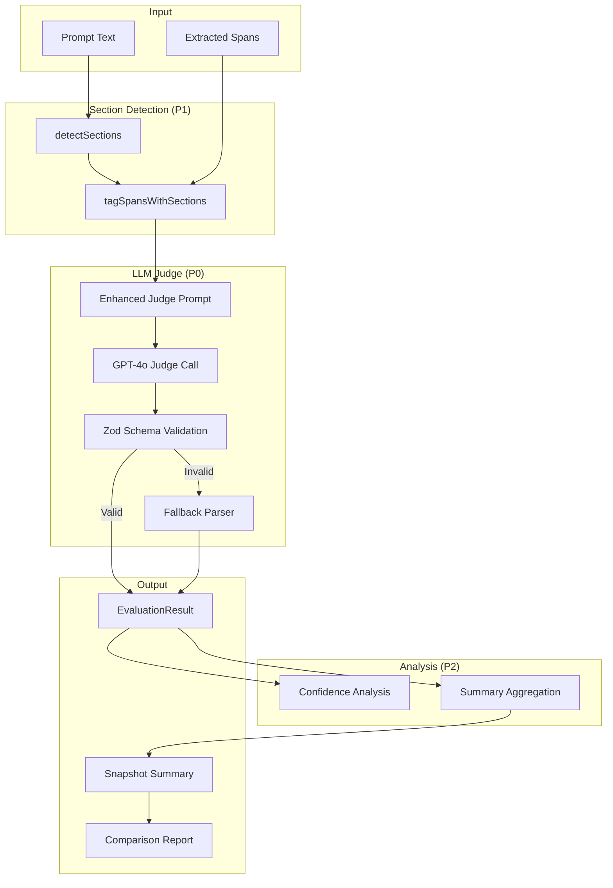
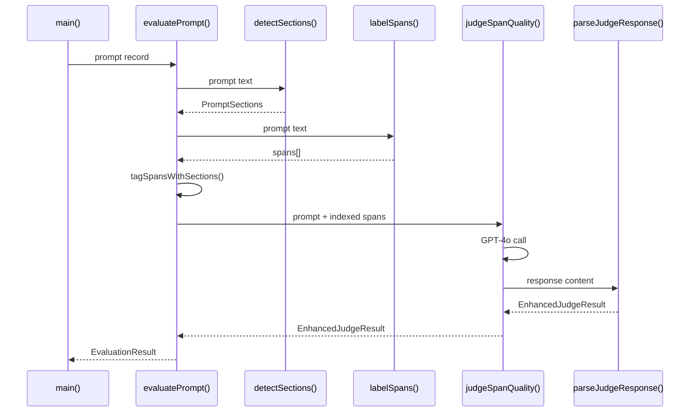

# Design Document

## Overview

This design document describes the enhanced span labeling evaluation system that provides detailed diagnostics for improving span extraction quality. The system extends the existing evaluation script with structured error typing, section boundary detection, per-category scoring, confidence correlation analysis, and enhanced comparison reporting.

The implementation follows a layered approach:
1. **Types Layer** - Shared TypeScript interfaces in a dedicated types file
2. **Detection Layer** - Section boundary detection using regex patterns
3. **Judge Layer** - Enhanced LLM judge prompt and response parsing with Zod validation
4. **Analysis Layer** - Confidence correlation and summary aggregation
5. **Reporting Layer** - Enhanced comparison and console output

## Architecture



## Components and Interfaces

### Types Module (`scripts/evaluation/types.ts`)

All shared interfaces will be centralized in a types file for maintainability.

```typescript
// =============================================================================
// Core Types
// =============================================================================

export type SectionType = 'main' | 'technicalSpecs' | 'alternatives';

export type FalsePositiveReason = 
  | 'section_header' 
  | 'abstract_concept' 
  | 'non_visual' 
  | 'instruction_text' 
  | 'duplicate' 
  | 'other';

export type Severity = 'critical' | 'important' | 'minor';

export type GranularityIssue = 'too_fine' | 'too_coarse';

// All 9 taxonomy categories
export type TaxonomyCategory = 
  | 'shot' 
  | 'subject' 
  | 'action' 
  | 'environment' 
  | 'lighting' 
  | 'camera' 
  | 'style' 
  | 'technical' 
  | 'audio';

export const TAXONOMY_CATEGORIES: TaxonomyCategory[] = [
  'shot', 'subject', 'action', 'environment', 'lighting', 
  'camera', 'style', 'technical', 'audio'
];

// =============================================================================
// Section Detection Types
// =============================================================================

export interface SectionBoundary {
  start: number;
  end: number;
}

export interface PromptSections {
  main: SectionBoundary;
  technicalSpecs: SectionBoundary | null;
  alternatives: SectionBoundary | null;
}

// =============================================================================
// Span Types
// =============================================================================

export interface SpanResult {
  text: string;
  role: string;
  confidence: number;
  start: number;
  end: number;
  section?: SectionType;
}

// =============================================================================
// Enhanced Judge Result Types
// =============================================================================

export interface MissedElement {
  text: string;
  expectedRole: string;
  category: string;
  severity: Severity;
}

export interface FalsePositive {
  spanIndex: number;
  text: string;
  assignedRole: string;
  reason: FalsePositiveReason;
}

export interface TaxonomyError {
  spanIndex: number;
  text: string;
  assignedRole: string;
  expectedRole: string;
}

export interface GranularityError {
  spanIndex: number;
  text: string;
  issue: GranularityIssue;
  suggestion: string;
}

export interface CategoryScore {
  coverage: number;  // 1-5
  precision: number; // 1-5
}

export type CategoryScores = Record<TaxonomyCategory, CategoryScore>;

export interface EnhancedJudgeResult {
  scores: {
    coverage: number;
    precision: number;
    granularity: number;
    taxonomy: number;
    technicalSpecs: number;
  };
  totalScore: number;
  missedElements: MissedElement[];
  falsePositives: FalsePositive[];
  taxonomyErrors: TaxonomyError[];
  granularityErrors: GranularityError[];
  categoryScores: CategoryScores;
  notes: string;
}

// =============================================================================
// Evaluation Metadata Types
// =============================================================================

export interface EvaluationMetadata {
  promptLength: number;
  sections: PromptSections;
  spansBySection: Record<SectionType, number>;
}

// =============================================================================
// Confidence Analysis Types
// =============================================================================

export interface ConfidenceBucket {
  range: [number, number];
  total: number;
  errors: number;
  errorRate: number;
}

export interface ConfidenceAnalysis {
  buckets: {
    high: ConfidenceBucket;
    medium: ConfidenceBucket;
    low: ConfidenceBucket;
  };
  recommendedThreshold: number | null;
  notes: string;
}

// =============================================================================
// Enhanced Summary Types
// =============================================================================

export interface SectionErrorCounts {
  falsePositives: number;
  missed: number;
}

export interface TaxonomyConfusion {
  assignedRole: string;
  expectedRole: string;
  count: number;
}

export interface EnhancedSummary {
  // Existing fields
  avgScore: number;
  avgSpanCount: number;
  scoreDistribution: Record<string, number>;
  errorCount: number;
  
  // Pipeline source tracking (existing)
  pipelineSources: {
    nlp: number;
    llm: number;
    unknown: number;
  };
  spanSources: {
    closedVocab: number;
    openVocab: number;
    llm: number;
  };
  
  // Enhanced fields
  avgCategoryScores: CategoryScores;
  falsePositiveReasons: Record<FalsePositiveReason, number>;
  topTaxonomyErrors: TaxonomyConfusion[];
  errorsBySection: Record<SectionType, SectionErrorCounts>;
  confidenceAnalysis?: ConfidenceAnalysis;
}

// =============================================================================
// Evaluation Result Types
// =============================================================================

export interface EvaluationResult {
  promptId: string;
  input: string;
  output: string;
  spanCount: number;
  spans: SpanResult[];
  meta: SpanLabelingMeta | null;
  metadata?: EvaluationMetadata;
  judgeResult: EnhancedJudgeResult | null;
  error: string | null;
  latencyMs: number;
}

export interface SpanLabelingMeta {
  version: string;
  notes: string;
  source?: string;
  closedVocab?: number;
  openVocab?: number;
  latency?: number;
  tier1Latency?: number;
  tier2Latency?: number;
}

// =============================================================================
// Snapshot Types
// =============================================================================

export interface Snapshot {
  timestamp: string;
  promptCount: number;
  sourceFile: string;
  judgeModel: string;
  results: EvaluationResult[];
  summary: EnhancedSummary;
}
```

### Section Detection Module

```typescript
// Section header patterns (case-insensitive)
const TECHNICAL_SPECS_PATTERN = /\*\*(?:TECHNICAL SPECS|Technical Specifications)\*\*/i;
const ALTERNATIVES_PATTERN = /\*\*(?:ALTERNATIVE|VARIATIONS)\*\*/i;

/**
 * Detect section boundaries in a prompt using regex patterns.
 * No LLM calls - pure string matching.
 */
export function detectSections(promptText: string): PromptSections {
  const techMatch = promptText.match(TECHNICAL_SPECS_PATTERN);
  const altMatch = promptText.match(ALTERNATIVES_PATTERN);
  
  // Determine section boundaries
  let techStart: number | null = techMatch?.index ?? null;
  let altStart: number | null = altMatch?.index ?? null;
  
  // Main section: from 0 to first header (or end)
  const mainEnd = Math.min(
    techStart ?? promptText.length,
    altStart ?? promptText.length
  );
  
  // Technical specs section
  let technicalSpecs: SectionBoundary | null = null;
  if (techStart !== null) {
    const techEnd = (altStart !== null && altStart > techStart) 
      ? altStart 
      : promptText.length;
    technicalSpecs = { start: techStart, end: techEnd };
  }
  
  // Alternatives section
  let alternatives: SectionBoundary | null = null;
  if (altStart !== null) {
    const altEnd = (techStart !== null && techStart > altStart)
      ? techStart
      : promptText.length;
    alternatives = { start: altStart, end: altEnd };
  }
  
  return {
    main: { start: 0, end: mainEnd },
    technicalSpecs,
    alternatives
  };
}

/**
 * Determine which section a span belongs to based on its start offset.
 */
export function getSpanSection(
  spanStart: number, 
  sections: PromptSections
): SectionType {
  if (sections.technicalSpecs && 
      spanStart >= sections.technicalSpecs.start && 
      spanStart < sections.technicalSpecs.end) {
    return 'technicalSpecs';
  }
  if (sections.alternatives && 
      spanStart >= sections.alternatives.start && 
      spanStart < sections.alternatives.end) {
    return 'alternatives';
  }
  return 'main';
}

/**
 * Tag all spans with their section.
 */
export function tagSpansWithSections(
  spans: SpanResult[], 
  sections: PromptSections
): SpanResult[] {
  return spans.map(span => ({
    ...span,
    section: getSpanSection(span.start, sections)
  }));
}
```

### Enhanced Judge Prompt

```typescript
export const ENHANCED_JUDGE_SYSTEM_PROMPT = `You are evaluating span labeling quality for video prompts.

A span is a "visual control point" - a phrase that, if changed, would produce a visually different video.

## Evaluation Criteria (score each 1-5)

1. **Coverage** (1-5): Did it extract ALL visual control points?
   - Subjects, actions, environments, lighting, camera movements, technical specs
   - 5 = Comprehensive, nothing missed
   - 1 = Major elements missing

2. **Precision** (1-5): Did it correctly SKIP abstract/non-renderable content?
   - Should skip: "determination", "inviting the viewer", "enhancing authenticity"
   - Should include: "focused demeanor" (visible expression), "gripping" (visible action)
   - 5 = Only extracted renderable elements
   - 1 = Extracted many abstract concepts

3. **Granularity** (1-5): Are span boundaries correct?
   - Not too fine: "soft" + "highlights" should be "soft highlights"
   - Not too coarse: Don't merge unrelated elements
   - 5 = All boundaries appropriate
   - 1 = Many boundary errors

4. **Taxonomy** (1-5): Are roles assigned correctly?
   - camera.movement vs action.movement
   - shot.type vs camera.angle
   - 5 = All roles correct
   - 1 = Many misclassifications

5. **Technical Specs** (1-5): Did it extract format parameters?
   - Duration, fps, aspect ratio, resolution
   - These are often in structured sections
   - 5 = All specs extracted
   - 1 = Specs ignored

## Error Types

### Missed Elements
Visual elements that should have been extracted but weren't.
- **critical**: Main subject, primary action, key environment
- **important**: Secondary subjects, lighting, camera movement
- **minor**: Subtle details, optional style elements

### False Positives (by reason)
- **section_header**: Extracted a markdown header like "**TECHNICAL SPECS**"
- **abstract_concept**: Non-visual concept like "determination", "authenticity"
- **non_visual**: Audio-only or non-renderable element
- **instruction_text**: Meta-instructions like "ensure smooth transition"
- **duplicate**: Same element extracted multiple times
- **other**: Other incorrect extraction

### Taxonomy Errors
Spans assigned to wrong category. Common confusions:
- camera.movement vs action.movement (camera moves vs subject moves)
- shot.type vs camera.angle (framing vs perspective)
- style.aesthetic vs lighting.quality

### Granularity Errors
- **too_fine**: Span should be merged with adjacent text
- **too_coarse**: Span contains unrelated elements that should be separate

## Category Scoring
Score each category's coverage (did we find all?) and precision (did we avoid false positives?):
- shot, subject, action, environment, lighting, camera, style, technical, audio

## Response Format

IMPORTANT: Use the span index (0-based) from the provided list to reference spans.

Return ONLY valid JSON:
{
  "scores": {
    "coverage": <1-5>,
    "precision": <1-5>,
    "granularity": <1-5>,
    "taxonomy": <1-5>,
    "technicalSpecs": <1-5>
  },
  "totalScore": <sum of above, max 25>,
  "missedElements": [
    { "text": "element text", "expectedRole": "category.attribute", "category": "category", "severity": "critical|important|minor" }
  ],
  "falsePositives": [
    { "spanIndex": 0, "text": "span text", "assignedRole": "role", "reason": "section_header|abstract_concept|non_visual|instruction_text|duplicate|other" }
  ],
  "taxonomyErrors": [
    { "spanIndex": 0, "text": "span text", "assignedRole": "wrong.role", "expectedRole": "correct.role" }
  ],
  "granularityErrors": [
    { "spanIndex": 0, "text": "span text", "issue": "too_fine|too_coarse", "suggestion": "what it should be" }
  ],
  "categoryScores": {
    "shot": { "coverage": <1-5>, "precision": <1-5> },
    "subject": { "coverage": <1-5>, "precision": <1-5> },
    "action": { "coverage": <1-5>, "precision": <1-5> },
    "environment": { "coverage": <1-5>, "precision": <1-5> },
    "lighting": { "coverage": <1-5>, "precision": <1-5> },
    "camera": { "coverage": <1-5>, "precision": <1-5> },
    "style": { "coverage": <1-5>, "precision": <1-5> },
    "technical": { "coverage": <1-5>, "precision": <1-5> },
    "audio": { "coverage": <1-5>, "precision": <1-5> }
  },
  "notes": "brief explanation of scoring"
}`;
```

### Zod Schema Validation

```typescript
import { z } from 'zod';

const SeveritySchema = z.enum(['critical', 'important', 'minor']);
const FalsePositiveReasonSchema = z.enum([
  'section_header', 'abstract_concept', 'non_visual', 
  'instruction_text', 'duplicate', 'other'
]);
const GranularityIssueSchema = z.enum(['too_fine', 'too_coarse']);

const CategoryScoreSchema = z.object({
  coverage: z.number().min(1).max(5),
  precision: z.number().min(1).max(5)
});

export const EnhancedJudgeResultSchema = z.object({
  scores: z.object({
    coverage: z.number().min(1).max(5),
    precision: z.number().min(1).max(5),
    granularity: z.number().min(1).max(5),
    taxonomy: z.number().min(1).max(5),
    technicalSpecs: z.number().min(1).max(5)
  }),
  totalScore: z.number().min(0).max(25),
  missedElements: z.array(z.object({
    text: z.string(),
    expectedRole: z.string(),
    category: z.string(),
    severity: SeveritySchema
  })),
  falsePositives: z.array(z.object({
    spanIndex: z.number().int().min(0),
    text: z.string(),
    assignedRole: z.string(),
    reason: FalsePositiveReasonSchema
  })),
  taxonomyErrors: z.array(z.object({
    spanIndex: z.number().int().min(0),
    text: z.string(),
    assignedRole: z.string(),
    expectedRole: z.string()
  })),
  granularityErrors: z.array(z.object({
    spanIndex: z.number().int().min(0),
    text: z.string(),
    issue: GranularityIssueSchema,
    suggestion: z.string()
  })),
  categoryScores: z.object({
    shot: CategoryScoreSchema,
    subject: CategoryScoreSchema,
    action: CategoryScoreSchema,
    environment: CategoryScoreSchema,
    lighting: CategoryScoreSchema,
    camera: CategoryScoreSchema,
    style: CategoryScoreSchema,
    technical: CategoryScoreSchema,
    audio: CategoryScoreSchema
  }),
  notes: z.string()
});

/**
 * Parse and validate judge response with fallback to basic format.
 */
export function parseJudgeResponse(
  content: string, 
  spanCount: number
): EnhancedJudgeResult {
  // Extract JSON from response
  const jsonMatch = content.match(/\{[\s\S]*\}/);
  if (!jsonMatch) {
    throw new Error('No JSON in judge response');
  }
  
  const parsed = JSON.parse(jsonMatch[0]);
  
  // Try enhanced schema first
  const result = EnhancedJudgeResultSchema.safeParse(parsed);
  if (result.success) {
    // Validate spanIndex bounds
    const maxIndex = spanCount - 1;
    for (const fp of result.data.falsePositives) {
      if (fp.spanIndex > maxIndex) {
        console.warn(`Invalid spanIndex ${fp.spanIndex} (max: ${maxIndex})`);
      }
    }
    return result.data;
  }
  
  // Fallback: convert basic format to enhanced
  console.warn('Judge response failed enhanced validation, using fallback');
  return convertBasicToEnhanced(parsed);
}

/**
 * Convert basic JudgeResult to EnhancedJudgeResult with defaults.
 */
function convertBasicToEnhanced(basic: any): EnhancedJudgeResult {
  const defaultCategoryScore = { coverage: 3, precision: 3 };
  
  return {
    scores: basic.scores || {
      coverage: 0, precision: 0, granularity: 0, taxonomy: 0, technicalSpecs: 0
    },
    totalScore: basic.totalScore || 0,
    missedElements: (basic.missedElements || []).map((text: string) => ({
      text: typeof text === 'string' ? text : text.text || '',
      expectedRole: 'unknown',
      category: 'unknown',
      severity: 'minor' as const
    })),
    falsePositives: (basic.incorrectExtractions || []).map((text: string, i: number) => ({
      spanIndex: -1, // Unknown
      text: typeof text === 'string' ? text : text.text || '',
      assignedRole: 'unknown',
      reason: 'other' as const
    })),
    taxonomyErrors: [],
    granularityErrors: [],
    categoryScores: {
      shot: defaultCategoryScore,
      subject: defaultCategoryScore,
      action: defaultCategoryScore,
      environment: defaultCategoryScore,
      lighting: defaultCategoryScore,
      camera: defaultCategoryScore,
      style: defaultCategoryScore,
      technical: defaultCategoryScore,
      audio: defaultCategoryScore
    },
    notes: basic.notes || 'Converted from basic format'
  };
}
```

### Span Formatting for Judge

```typescript
/**
 * Format spans with indices for the judge prompt.
 * Example: "[0] 'Medium Shot' (shot.type, 0.95)"
 */
export function formatSpansForJudge(spans: SpanResult[]): string {
  return spans.map((span, index) => 
    `[${index}] '${span.text}' (${span.role}, ${span.confidence.toFixed(2)})`
  ).join('\n');
}
```

### Confidence Analysis Module

```typescript
/**
 * Compute confidence correlation analysis.
 */
export function computeConfidenceAnalysis(
  results: EvaluationResult[]
): ConfidenceAnalysis {
  const buckets = {
    high: { range: [0.8, 1.0] as [number, number], total: 0, errors: 0, errorRate: 0 },
    medium: { range: [0.6, 0.8] as [number, number], total: 0, errors: 0, errorRate: 0 },
    low: { range: [0.0, 0.6] as [number, number], total: 0, errors: 0, errorRate: 0 }
  };
  
  // Collect all spans with their error status
  for (const result of results) {
    if (!result.judgeResult) continue;
    
    // Build set of error span indices
    const errorIndices = new Set<number>();
    for (const fp of result.judgeResult.falsePositives) {
      if (fp.spanIndex >= 0) errorIndices.add(fp.spanIndex);
    }
    for (const te of result.judgeResult.taxonomyErrors) {
      if (te.spanIndex >= 0) errorIndices.add(te.spanIndex);
    }
    for (const ge of result.judgeResult.granularityErrors) {
      if (ge.spanIndex >= 0) errorIndices.add(ge.spanIndex);
    }
    
    // Categorize each span by confidence bucket
    for (let i = 0; i < result.spans.length; i++) {
      const span = result.spans[i];
      const conf = span.confidence;
      const isError = errorIndices.has(i);
      
      let bucket: keyof typeof buckets;
      if (conf >= 0.8) bucket = 'high';
      else if (conf >= 0.6) bucket = 'medium';
      else bucket = 'low';
      
      buckets[bucket].total++;
      if (isError) buckets[bucket].errors++;
    }
  }
  
  // Compute error rates
  for (const key of Object.keys(buckets) as (keyof typeof buckets)[]) {
    const b = buckets[key];
    b.errorRate = b.total > 0 ? b.errors / b.total : 0;
  }
  
  // Determine recommended threshold
  let recommendedThreshold: number | null = null;
  let notes = '';
  
  if (buckets.low.errorRate > 0.5) {
    recommendedThreshold = 0.6;
    notes = `Low confidence spans (< 0.6) have ${(buckets.low.errorRate * 100).toFixed(1)}% error rate. Consider raising threshold to 0.6.`;
  } else if (buckets.medium.errorRate > 0.5) {
    recommendedThreshold = 0.8;
    notes = `Medium confidence spans (0.6-0.8) have ${(buckets.medium.errorRate * 100).toFixed(1)}% error rate. Consider raising threshold to 0.8.`;
  } else {
    notes = 'Confidence scores correlate well with accuracy. Current threshold is appropriate.';
  }
  
  return { buckets, recommendedThreshold, notes };
}
```

### Enhanced Summary Computation

```typescript
/**
 * Compute enhanced summary with all new aggregations.
 */
export function computeEnhancedSummary(
  results: EvaluationResult[]
): EnhancedSummary {
  // ... existing summary computation ...
  
  // Initialize category score accumulators
  const categoryTotals: Record<TaxonomyCategory, { coverage: number; precision: number; count: number }> = 
    Object.fromEntries(
      TAXONOMY_CATEGORIES.map(cat => [cat, { coverage: 0, precision: 0, count: 0 }])
    ) as any;
  
  // Initialize false positive reason counts
  const falsePositiveReasons: Record<FalsePositiveReason, number> = {
    section_header: 0,
    abstract_concept: 0,
    non_visual: 0,
    instruction_text: 0,
    duplicate: 0,
    other: 0
  };
  
  // Initialize taxonomy confusion tracking
  const taxonomyConfusions = new Map<string, number>();
  
  // Initialize section error counts
  const errorsBySection: Record<SectionType, SectionErrorCounts> = {
    main: { falsePositives: 0, missed: 0 },
    technicalSpecs: { falsePositives: 0, missed: 0 },
    alternatives: { falsePositives: 0, missed: 0 }
  };
  
  // Aggregate from results
  for (const result of results) {
    if (!result.judgeResult) continue;
    
    // Category scores
    for (const cat of TAXONOMY_CATEGORIES) {
      const score = result.judgeResult.categoryScores[cat];
      if (score) {
        categoryTotals[cat].coverage += score.coverage;
        categoryTotals[cat].precision += score.precision;
        categoryTotals[cat].count++;
      }
    }
    
    // False positive reasons
    for (const fp of result.judgeResult.falsePositives) {
      falsePositiveReasons[fp.reason]++;
      
      // Section tracking (if span has section tag)
      if (fp.spanIndex >= 0 && fp.spanIndex < result.spans.length) {
        const section = result.spans[fp.spanIndex].section || 'main';
        errorsBySection[section].falsePositives++;
      }
    }
    
    // Taxonomy confusions
    for (const te of result.judgeResult.taxonomyErrors) {
      const key = `${te.assignedRole} -> ${te.expectedRole}`;
      taxonomyConfusions.set(key, (taxonomyConfusions.get(key) || 0) + 1);
    }
    
    // Missed elements by section (estimate from metadata if available)
    // Note: Missed elements don't have spanIndex, so we can't directly map to sections
    // This would require the judge to also report which section the missed element was in
  }
  
  // Compute averages
  const avgCategoryScores: CategoryScores = Object.fromEntries(
    TAXONOMY_CATEGORIES.map(cat => {
      const t = categoryTotals[cat];
      return [cat, {
        coverage: t.count > 0 ? t.coverage / t.count : 0,
        precision: t.count > 0 ? t.precision / t.count : 0
      }];
    })
  ) as CategoryScores;
  
  // Top 10 taxonomy confusions
  const topTaxonomyErrors = [...taxonomyConfusions.entries()]
    .map(([key, count]) => {
      const [assigned, expected] = key.split(' -> ');
      return { assignedRole: assigned, expectedRole: expected, count };
    })
    .sort((a, b) => b.count - a.count)
    .slice(0, 10);
  
  // Compute confidence analysis
  const confidenceAnalysis = computeConfidenceAnalysis(results);
  
  return {
    // ... existing fields ...
    avgCategoryScores,
    falsePositiveReasons,
    topTaxonomyErrors,
    errorsBySection,
    confidenceAnalysis
  };
}
```

## Data Models

### Evaluation Flow



### Backward Compatibility

Old snapshots without enhanced fields will be handled gracefully:

```typescript
function loadSnapshotWithDefaults(snapshot: any): Snapshot {
  return {
    ...snapshot,
    summary: {
      ...snapshot.summary,
      avgCategoryScores: snapshot.summary.avgCategoryScores || getDefaultCategoryScores(),
      falsePositiveReasons: snapshot.summary.falsePositiveReasons || getDefaultReasonCounts(),
      topTaxonomyErrors: snapshot.summary.topTaxonomyErrors || [],
      errorsBySection: snapshot.summary.errorsBySection || getDefaultSectionErrors(),
      confidenceAnalysis: snapshot.summary.confidenceAnalysis || null
    }
  };
}
```


## Correctness Properties

*A property is a characteristic or behavior that should hold true across all valid executions of a system—essentially, a formal statement about what the system should do. Properties serve as the bridge between human-readable specifications and machine-verifiable correctness guarantees.*

Based on the acceptance criteria analysis, the following properties must hold:

### Property 1: EnhancedJudgeResult Schema Round-Trip

*For any* valid EnhancedJudgeResult object, serializing to JSON and parsing with the Zod schema should produce an equivalent object with all required fields present and correctly typed.

**Validates: Requirements 1.1, 1.2, 1.3, 1.4, 1.5**

### Property 2: Fallback Parsing Produces Valid Defaults

*For any* malformed or basic-format judge response, the fallback parser should produce a valid EnhancedJudgeResult with all required fields populated with sensible defaults (empty arrays, default scores).

**Validates: Requirements 1.6**

### Property 3: Section Boundary Detection

*For any* prompt text containing section headers ("**TECHNICAL SPECS**", "**Technical Specifications**", "**ALTERNATIVE", "**VARIATIONS**"), the detectSections function should return boundaries where:
- main.start is always 0
- main.end equals the position of the first header (or prompt length if no headers)
- technicalSpecs.start equals the header position (if present)
- alternatives.start equals the header position (if present)

**Validates: Requirements 2.1, 2.2, 2.3**

### Property 4: Span Section Tagging Correctness

*For any* span with a start offset and any PromptSections boundaries, the getSpanSection function should return:
- 'technicalSpecs' if start is within technicalSpecs boundaries
- 'alternatives' if start is within alternatives boundaries
- 'main' otherwise

**Validates: Requirements 2.4, 2.6**

### Property 5: Summary Category Score Aggregation

*For any* list of EvaluationResults with known categoryScores, the computed avgCategoryScores should equal the arithmetic mean of each category's coverage and precision across all results.

**Validates: Requirements 3.1**

### Property 6: Summary Error Aggregation

*For any* list of EvaluationResults with known falsePositives and taxonomyErrors, the computed summary should have:
- falsePositiveReasons counts matching the sum of each reason type
- topTaxonomyErrors containing the 10 most frequent (assignedRole, expectedRole) pairs sorted by count descending

**Validates: Requirements 3.2, 3.3, 3.4**

### Property 7: Backward Compatibility with Defaults

*For any* snapshot object missing enhanced fields (avgCategoryScores, falsePositiveReasons, topTaxonomyErrors, errorsBySection), loading with loadSnapshotWithDefaults should produce a valid Snapshot with default values without throwing errors.

**Validates: Requirements 3.5, 5.4**

### Property 8: Confidence Bucket Computation

*For any* list of EvaluationResults with spans having known confidence values and error indices, the computeConfidenceAnalysis function should:
- Correctly bucket spans by confidence (high: 0.8-1.0, medium: 0.6-0.8, low: 0.0-0.6)
- Count total spans and error spans per bucket
- Compute errorRate as errors/total for each bucket

**Validates: Requirements 4.1, 4.2, 4.4**

### Property 9: Confidence Threshold Recommendation

*For any* confidence analysis where a bucket has errorRate > 0.5, the recommendedThreshold should be set to the upper bound of that bucket (0.6 for low, 0.8 for medium).

**Validates: Requirements 4.3**

### Property 10: Snapshot Comparison Deltas

*For any* two snapshots with known avgCategoryScores and topTaxonomyErrors, the comparison should correctly compute:
- Per-category score deltas (current - baseline)
- New taxonomy confusions (in current but not baseline)
- Resolved taxonomy confusions (in baseline but not current)

**Validates: Requirements 5.1, 5.2, 5.3**

### Property 11: Span Formatting for Judge

*For any* array of SpanResult objects, formatSpansForJudge should produce a string where each line contains the span's index, text, role, and confidence in the format: `[index] 'text' (role, confidence)`

**Validates: Requirements 6.4**

## Error Handling

### Judge Response Errors

1. **No JSON in response**: Log warning, return fallback result with zero scores
2. **Invalid JSON syntax**: Log warning, return fallback result
3. **Schema validation failure**: Log warning with validation errors, convert to enhanced format with defaults
4. **Invalid spanIndex**: Log warning, keep the error entry but mark spanIndex as -1 (unknown)
5. **Network/timeout errors**: Propagate error to EvaluationResult.error field

### Section Detection Errors

1. **Empty prompt**: Return main section spanning 0-0, null for other sections
2. **Malformed headers**: Regex won't match, section treated as not present
3. **Overlapping sections**: Use first match position, sections don't overlap by design

### Summary Computation Errors

1. **No successful results**: Return zero averages, empty arrays
2. **Missing judgeResult**: Skip result in aggregations
3. **Invalid category in categoryScores**: Skip that category, log warning

### Backward Compatibility

1. **Missing summary fields**: Apply defaults via loadSnapshotWithDefaults
2. **Missing result fields**: Apply defaults at result level
3. **Type mismatches**: Zod parsing with .passthrough() to preserve unknown fields

## Testing Strategy

### Dual Testing Approach

This feature requires both unit tests and property-based tests:

- **Unit tests**: Verify specific examples, edge cases, and error conditions
- **Property tests**: Verify universal properties across all valid inputs

### Property-Based Testing Configuration

- **Library**: fast-check (already used in project)
- **Minimum iterations**: 100 per property test
- **Tag format**: `Feature: enhanced-span-evaluation, Property N: {property_text}`

### Test File Structure

```
tests/unit/
  enhanced-span-evaluation.test.ts       # Unit tests
  enhanced-span-evaluation.property.test.ts  # Property tests
```

### Unit Test Coverage

1. **Section Detection**
   - Prompt with no headers → main only
   - Prompt with TECHNICAL SPECS only
   - Prompt with ALTERNATIVES only
   - Prompt with both headers
   - Case variations in headers

2. **Judge Response Parsing**
   - Valid enhanced response
   - Valid basic response (fallback)
   - Invalid JSON
   - Missing required fields
   - Out-of-bounds spanIndex

3. **Summary Aggregation**
   - Empty results array
   - Single result
   - Multiple results with varying scores

4. **Confidence Analysis**
   - All spans in one bucket
   - Spans distributed across buckets
   - No errors (0% error rate)
   - All errors (100% error rate)

5. **Snapshot Comparison**
   - Identical snapshots
   - Improved scores
   - Regressed scores
   - New/resolved taxonomy errors

### Property Test Coverage

Each correctness property (1-11) will have a corresponding property-based test that:
1. Generates random valid inputs using fast-check arbitraries
2. Executes the function under test
3. Asserts the property holds

### Arbitraries (Generators)

```typescript
// SpanResult generator
const spanResultArb = fc.record({
  text: fc.string({ minLength: 1, maxLength: 100 }),
  role: fc.constantFrom(...VALID_ROLES),
  confidence: fc.float({ min: 0, max: 1 }),
  start: fc.nat({ max: 10000 }),
  end: fc.nat({ max: 10000 }),
  section: fc.constantFrom('main', 'technicalSpecs', 'alternatives')
});

// CategoryScore generator
const categoryScoreArb = fc.record({
  coverage: fc.integer({ min: 1, max: 5 }),
  precision: fc.integer({ min: 1, max: 5 })
});

// EnhancedJudgeResult generator
const enhancedJudgeResultArb = fc.record({
  scores: fc.record({
    coverage: fc.integer({ min: 1, max: 5 }),
    precision: fc.integer({ min: 1, max: 5 }),
    granularity: fc.integer({ min: 1, max: 5 }),
    taxonomy: fc.integer({ min: 1, max: 5 }),
    technicalSpecs: fc.integer({ min: 1, max: 5 })
  }),
  totalScore: fc.integer({ min: 0, max: 25 }),
  missedElements: fc.array(missedElementArb),
  falsePositives: fc.array(falsePositiveArb),
  taxonomyErrors: fc.array(taxonomyErrorArb),
  granularityErrors: fc.array(granularityErrorArb),
  categoryScores: categoryScoresArb,
  notes: fc.string()
});
```

### Integration Testing

Manual integration testing with real prompts:
1. Run evaluation on `data/evaluation-prompts-latest.json`
2. Verify enhanced judge responses parse correctly
3. Verify summary aggregations are accurate
4. Verify comparison report shows new metrics
