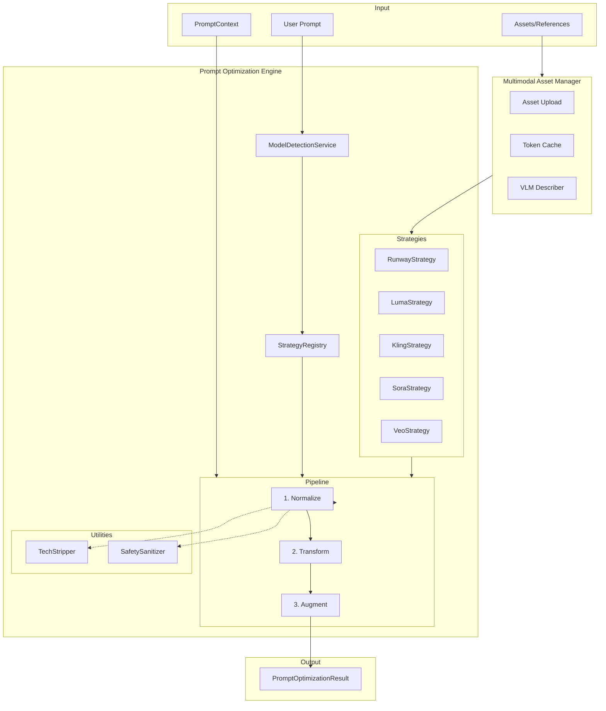

# Design Document: Video Model Prompt Optimization Engine

## Overview

This document describes the design for a Prompt Optimization Engine (POE) that transforms user prompts into model-specific optimized outputs for AI video generation. The system implements a polymorphic middleware architecture with a 3-phase pipeline (Normalize → Transform → Augment) supporting five video models: Runway Gen-4.5, Luma Ray-3, Kling AI 2.6, OpenAI Sora 2, and Google Veo 4.

The architecture follows the Strategy pattern, allowing each model to define its own optimization logic while sharing common utilities (TechStripper, SafetySanitizer) and infrastructure (MAM).

## Architecture



## Components and Interfaces

### Core Interfaces

```typescript
// server/src/services/video-prompt-analysis/strategies/types.ts

/**
 * Result of prompt optimization pipeline
 */
export interface PromptOptimizationResult {
  /** The optimized prompt (string for text-based, object for JSON-based like Veo) */
  prompt: string | Record<string, unknown>;
  /** Optional negative prompt for models that support it */
  negativePrompt?: string;
  /** Metadata about the optimization process */
  metadata: OptimizationMetadata;
}

export interface OptimizationMetadata {
  modelId: string;
  pipelineVersion: string;
  phases: PhaseResult[];
  warnings: string[];
  tokensStripped: string[];
  triggersInjected: string[];
}

export interface PhaseResult {
  phase: 'normalize' | 'transform' | 'augment';
  durationMs: number;
  changes: string[];
}

/**
 * Context provided to optimization strategies
 */
export interface PromptContext {
  userIntent: string;
  detectedSection?: string;
  constraints?: ConstraintConfig;
  history?: EditHistoryEntry[];
  apiParams?: Record<string, unknown>;
  assets?: AssetReference[];
}

export interface AssetReference {
  type: 'image' | 'video' | 'cameo';
  localPath?: string;
  url?: string;
  token?: string;
  description?: string;
}

/**
 * Strategy interface for model-specific optimization
 */
export interface PromptOptimizationStrategy {
  readonly modelId: string;
  readonly modelName: string;

  /**
   * Phase 0: Validate input against model constraints (Aspect ratios, duration, physics)
   * Returns warnings or throws errors for hard constraints.
   */
  validate(input: string, context?: PromptContext): Promise<void>;
  
  /**
   * Phase 1: Strip incompatible tokens and normalize input
   */
  normalize(input: string, context?: PromptContext): string;
  
  /**
   * Phase 2: Translate intent into model-native structure
   */
  transform(input: string, context?: PromptContext): PromptOptimizationResult;
  
  /**
   * Phase 3: Inject model-specific triggers and enforce compliance
   * Note: Runway strategy must inject VLM descriptions from assets here.
   */
  augment(result: PromptOptimizationResult, context?: PromptContext): PromptOptimizationResult;
}
```

### Strategy Registry

```typescript
// server/src/services/video-prompt-analysis/strategies/StrategyRegistry.ts

export class StrategyRegistry {
  private strategies: Map<string, PromptOptimizationStrategy> = new Map();
  
  register(strategy: PromptOptimizationStrategy): void;
  get(modelId: string): PromptOptimizationStrategy | undefined;
  getAll(): PromptOptimizationStrategy[];
  has(modelId: string): boolean;
}
```

### Model Detection Enhancement

```typescript
// server/src/services/video-prompt-analysis/services/detection/ModelDetectionService.ts

// New model patterns to add
const NEW_MODEL_PATTERNS = {
  'runway-gen45': {
    keywords: ['gen-4.5', 'gen4.5', 'gen 4.5', 'runway gen 4.5', 'whisper thunder'],
    indicators: /\b(gen[_\s-]?4\.?5|whisper\s*thunder)\b/i,
  },
  'luma-ray3': {
    keywords: ['ray-3', 'ray3', 'ray 3', 'luma ray', 'luma ray-3'],
    indicators: /\b(ray[_\s-]?3|luma\s*ray)\b/i,
  },
  'kling-26': {
    keywords: ['kling 2.6', 'kling2.6', 'kling ai 2.6'],
    indicators: /\b(kling[_\s-]?2\.?6)\b/i,
  },
  'sora-2': {
    keywords: ['sora 2', 'sora2', 'openai sora 2'],
    indicators: /\b(sora[_\s-]?2|openai\s*sora\s*2)\b/i,
  },
  'veo-4': {
    keywords: ['veo 4', 'veo4', 'google veo 4', 'veo 4'],
    indicators: /\b(veo[_\s-]?4|google\s*veo\s*4)\b/i,
  },
} as const;
```

## Data Models

### Luma Ray-3 Structure

```typescript
interface LumaPromptStructure {
  prompt: string;
  negative_prompt?: string; // Implicitly supported via "Modify" or exclusion
  keyframes?: {
    frame0?: { url: string; type: 'image' };
    frame1?: { url: string; type: 'image' };
  };
  loop: boolean;
  aspect_ratio?: string;
  render_settings: {
    hdr: boolean; // Triggers 16-bit EXR pipeline
    motion_speed?: 'slow' | 'normal' | 'fast';
  };
}
```

### Runway CSAE Structure

```typescript
interface RunwayPromptStructure {
  camera: {
    movement?: string;  // pan, tilt, truck, pedestal, dolly, zoom
    angle?: string;     // low, high, eye-level, dutch
    lens?: string;      // wide, telephoto, macro
  };
  subject: {
    description: string;
    invariants: string[];  // features that must remain consistent
    reference_description?: string; // Appended from VLM for visual consistency
  };
  action: {
    temporal: string;      // what happens over time
    physics?: string[];    // physical interactions
  };
  environment: {
    setting: string;
    lighting?: string;
    atmosphere?: string;
  };
}
```

### Veo JSON Schema

```typescript
interface VeoPromptSchema {
  mode: 'generate' | 'edit'; // Supports Flow editing
  edit_config?: {
    instruction: string; // "Remove the boom mic"
    mask?: string;       // "mask the sky"
  };
  negative_prompt?: string;
  subject: {
    description: string;
    action: string;
  };
  camera: {
    type: string;
    movement: string;
  };
  environment: {
    lighting: string;
    weather?: string;
    setting?: string;
  };
  audio?: {
    dialogue?: string;
    ambience?: string;
    music?: string;
  };
  style_preset?: string;
  brand_context?: {
    colors?: string[];
    style_guide?: string;
  };
}
```

### Kling Screenplay Format

```typescript
interface KlingScreenplayBlock {
  visual: string;
  negative_prompt?: string;
  audio: AudioBlock[];
  dialogue: DialogueLine[];
  memflow_context?: {
    entity_ids: string[]; // IDs of characters/objects established in previous shots
    continuity_description: string; // "The same man from shot 1..."
  };
}

interface AudioBlock {
  type: 'sfx' | 'ambience' | 'music';
  description: string;
}

interface DialogueLine {
  character: string;
  emotion?: string;
  line: string;
}
```

### Sora Temporal Sequence

```typescript
interface SoraSequence {
  shots: SoraShot[];
  physics: PhysicsConstraints;
}

interface SoraShot {
  index: number;
  startTime: number;
  endTime: number;
  description: string;
  transitions?: string;
}

interface PhysicsConstraints {
  gravity: boolean;
  momentum: boolean;
  collisions: boolean;
  friction: boolean;
}
```

## Correctness Properties

*A property is a characteristic or behavior that should hold true across all valid executions of a system—essentially, a formal statement about what the system should do. Properties serve as the bridge between human-readable specifications and machine-verifiable correctness guarantees.*

### Property 1: Model Detection Correctness

*For any* prompt string containing a model identifier pattern (e.g., "gen-4.5", "ray-3", "kling 2.6", "sora 2", "veo 4"), the ModelDetectionService SHALL return the corresponding model ID, and for prompts without any model pattern, it SHALL return null.

**Validates: Requirements 2.1, 2.2, 2.3, 2.4, 2.5, 2.6**

### Property 2: Strategy Pipeline Validity

*For any* PromptOptimizationStrategy implementation and any valid input string, executing the full pipeline (normalize → transform → augment) SHALL produce a valid PromptOptimizationResult with non-null prompt field and populated metadata.

**Validates: Requirements 1.1, 1.2, 1.3, 1.4, 1.5**

### Property 3: Normalization Token Stripping

*For any* strategy and input containing model-incompatible tokens (as defined per strategy), the normalize phase SHALL return text that does not contain those incompatible tokens, while preserving the semantic intent of the original prompt.

**Validates: Requirements 3.1, 3.2, 4.1, 4.2, 5.1, 5.2, 6.1, 7.1**

### Property 4: Runway CSAE Ordering

*For any* Runway prompt containing camera, subject, action, and environment elements, the transform phase SHALL produce output where camera terms appear before subject terms, subject terms appear before action terms, and action terms appear before environment terms.

**Validates: Requirements 3.3, 3.4**

### Property 5: Veo JSON Schema Validity

*For any* Veo prompt, the transform phase SHALL produce a valid JSON object containing at minimum: subject.description, subject.action, camera.type, camera.movement, environment.lighting fields.

**Validates: Requirements 7.2, 7.3, 7.5**

### Property 6: Augmentation Trigger Injection

*For any* strategy and input, the augment phase SHALL inject at least one model-specific trigger into the result, and the output SHALL contain all required triggers for that model (e.g., "single continuous shot" for Runway, HDR triggers for Luma).

**Validates: Requirements 3.5, 3.6, 3.7, 4.4, 4.5, 5.5, 6.5, 6.6, 7.4**

### Property 7: TechStripper Model-Aware Behavior

*For any* input containing placebo tokens ("4k", "8k", "trending on artstation", "award winning") and any model identifier, TechStripper SHALL remove tokens for Runway/Luma models and preserve tokens for Kling/Veo models.

**Validates: Requirements 8.1, 8.2, 8.3, 8.4, 8.5**

### Property 8: SafetySanitizer Replacement Consistency

*For any* input containing blocked terms, SafetySanitizer SHALL return sanitized text where all blocked terms are replaced with generic descriptors, and the replacements list SHALL contain an entry for each replacement made. For inputs without blocked terms, the original text SHALL be returned unchanged.

**Validates: Requirements 9.1, 9.2, 9.3, 9.4, 9.5**

### Property 9: Cross-Model Translation Isolation

*For any* input, translateToAllModels SHALL return results for all 5 supported models, and if any single strategy throws an error, the other strategies SHALL still execute successfully and return their results.

**Validates: Requirements 11.1, 11.2, 11.3, 11.4**

### Property 10: MAM Token Caching

*For any* asset uploaded to MAM, subsequent requests for the same asset (by content hash) SHALL return the cached token without re-uploading, and the cached token SHALL be valid for the target provider.

**Validates: Requirements 12.3, 12.5**

## Error Handling

### Strategy Errors

```typescript
class StrategyError extends Error {
  constructor(
    public readonly modelId: string,
    public readonly phase: 'normalize' | 'transform' | 'augment',
    public readonly originalError: Error,
    message: string
  ) {
    super(message);
    this.name = 'StrategyError';
  }
}
```

### Error Recovery

1. **Normalize Phase Failure**: Return original input, log warning
2. **Transform Phase Failure**: Return input wrapped in basic result structure
3. **Augment Phase Failure**: Return transform result without augmentation
4. **MAM Upload Failure**: Continue without asset, add warning to metadata

### Validation Errors

- Invalid model ID: Return null from detection, skip optimization
- Invalid JSON schema (Veo): Attempt repair, fallback to text prompt
- Invalid CSAE structure (Runway): Use best-effort ordering
- Safety violation: Block request, return error with explanation

## Testing Strategy

### Unit Tests

Unit tests will verify specific examples and edge cases:

- Model detection with various pattern formats
- Individual strategy phase outputs
- TechStripper token identification
- SafetySanitizer replacement logic
- JSON schema validation for Veo
- CSAE ordering verification for Runway

### Property-Based Tests

Property-based tests will use **fast-check** to verify universal properties:

1. **Model Detection Property Test** (100+ iterations)
   - Generate random prompts with/without model patterns
   - Verify correct model ID or null returned

2. **Pipeline Validity Property Test** (100+ iterations)
   - Generate random valid inputs
   - Verify all strategies produce valid results

3. **Normalization Property Test** (100+ iterations)
   - Generate inputs with incompatible tokens
   - Verify tokens are stripped

4. **CSAE Ordering Property Test** (100+ iterations)
   - Generate Runway prompts with mixed element order
   - Verify output follows CSAE order

5. **Veo JSON Property Test** (100+ iterations)
   - Generate various Veo inputs
   - Verify JSON schema compliance

6. **TechStripper Property Test** (100+ iterations)
   - Generate inputs with placebo tokens
   - Verify model-aware removal/preservation

7. **SafetySanitizer Property Test** (100+ iterations)
   - Generate inputs with/without blocked terms
   - Verify replacement behavior

8. **Cross-Model Isolation Property Test** (100+ iterations)
   - Generate inputs that may cause strategy failures
   - Verify other strategies still succeed

9. **MAM Caching Property Test** (100+ iterations)
   - Upload same asset multiple times
   - Verify token consistency and no re-upload

### Integration Tests

- Full pipeline execution for each model
- VideoPromptService integration
- MAM with mock provider endpoints
