# Prompt Optimization Pipeline Analysis

## Scope

This document traces the current text-to-video prompt optimization pipeline across both server endpoints and the client wrappers, then identifies the structural seams that cause duplicated work, data loss, and silent divergence.

Unless noted otherwise, the call-count analysis assumes a cold `/api/optimize` request with:

- `targetModel=sora-2`
- `PROMPT_OUTPUT_ONLY=false`
- no optimization-cache hit
- no precomputed `shotPlan`
- no i2v path (`startImage` absent)

The full optimization cache short-circuits the entire pipeline before any Stage 1 or Stage 2 work runs (`server/src/services/prompt-optimization/workflows/optimizeFlow.ts:60-87`).

## Pipeline Flow Diagram

```mermaid
flowchart TD
  A["Client: usePromptOptimizerApi.analyzeAndOptimize()<br/>client/src/hooks/usePromptOptimizerApi.ts:17-73"]
  B["Client: PromptOptimizationApi.optimize()<br/>client/src/services/PromptOptimizationApi.ts:22-63"]
  C["HTTP: /optimize handler<br/>server/src/routes/optimize/handlers/optimize.ts:9-167"]
  D["PromptOptimizationService.optimize()<br/>server/src/services/prompt-optimization/PromptOptimizationService.ts:85-141"]
  E["runOptimizeFlow()<br/>server/src/services/prompt-optimization/workflows/optimizeFlow.ts:4-234"]
  F{"Optimization cache hit?<br/>optimizeFlow.ts:60-87"}
  G["ShotInterpreterService.interpret()<br/>ShotInterpreterService.ts:38-120"]
  G1["LLM #1: optimize_shot_interpreter<br/>returns ShotPlan JSON"]
  H["StrategyFactory.getStrategy('video')<br/>StrategyFactory.ts:38-47"]
  I["VideoStrategy.optimize()<br/>VideoStrategy.ts:89-264"]
  I1["LLM #2: optimize_standard<br/>provider-specific structured slot extraction"]
  I2["Optional extra LLM calls:<br/>reroll / repair / fallback"]
  J["VideoStrategy._reassembleOutput()<br/>VideoStrategy.ts:327-350"]
  K["IntentLock #1<br/>optimizeFlow.ts:143-153"]
  L["PromptLint #1<br/>optimizeFlow.ts:155-160"]
  M["VideoPromptCompilationService.compileOptimizedPrompt()<br/>VideoPromptCompilationService.ts:34-98"]
  N["VideoPromptService.optimizeForModel()<br/>VideoPromptService.ts:321-490"]
  O["StrategyRegistry.get(modelId)<br/>StrategyRegistry.ts:46-54"]
  P["BaseStrategy.validate() / normalize() / transform() / augment()<br/>BaseStrategy.ts:166-343"]
  Q["VideoPromptAnalyzer.analyze()<br/>VideoPromptAnalyzer.ts:37-91"]
  Q1["LLM #3: video_prompt_ir_extraction<br/>conditional IR rebuild"]
  R["VideoPromptLLMRewriter.rewrite()<br/>VideoPromptLLMRewriter.ts:15-38"]
  R1["LLM #4: video_prompt_rewrite<br/>model-specific rewrite prompt"]
  S["Model strategy doTransform()/doAugment()<br/>e.g. SoraStrategy.ts:169-224"]
  T["IntentLock #2<br/>optimizeFlow.ts:177-187"]
  U["PromptLint #2<br/>optimizeFlow.ts:189-197"]
  V["OptimizationCacheService.cacheResult()<br/>OptimizationCacheService.ts:24-29"]
  W["HTTP response<br/>optimize.ts:146-167"]

  A --> B --> C --> D --> E --> F
  F -- "yes" --> W
  F -- "no" --> G --> G1 --> H --> I --> I1 --> J --> K --> L --> M --> N --> O --> P --> Q --> Q1 --> R --> R1 --> S --> T --> U --> V --> W
  I --> I2
```

Compile-only flow:

```mermaid
flowchart LR
  A["Client: compilePrompt()<br/>client/src/services/PromptOptimizationApi.ts:65-81"]
  B["HTTP: /optimize-compile handler<br/>server/src/routes/optimize/handlers/optimizeCompile.ts:8-102"]
  C["PromptOptimizationService.compilePrompt()<br/>server/src/services/prompt-optimization/PromptOptimizationService.ts:161-212"]
  D["VideoPromptCompilationService.compilePrompt()<br/>server/src/services/prompt-optimization/services/VideoPromptCompilationService.ts:100-140"]
  E["VideoPromptService.optimizeForModel()<br/>server/src/services/video-prompt-analysis/VideoPromptService.ts:321-490"]
  F["IntentLock + PromptLint after compilation<br/>PromptOptimizationService.ts:182-205"]
  G["HTTP response"]
  A --> B --> C --> D --> E --> F --> G
```

## Findings

### 1. Data flow mapping

Stage 1 computes a rich structured artifact, then flattens it to prose before Stage 2 sees it.

- `VideoPromptSlots` contains `shot_framing`, `camera_angle`, `camera_move`, `subject`, `subject_details`, `action`, `setting`, `time`, `lighting`, and `style`. `VideoPromptStructuredResponse` extends that with `_creative_strategy`, `technical_specs`, `variations`, and `shot_plan` (`server/src/services/prompt-optimization/strategies/videoPromptTypes.ts:14-32`).
- `VideoStrategy.optimize()` parses the Stage 1 LLM response into `VideoPromptStructuredResponse`, normalizes it into `VideoPromptSlots`, and may reroll or repair that same structured artifact (`server/src/services/prompt-optimization/strategies/VideoStrategy.ts:173-245`, `server/src/services/prompt-optimization/strategies/video/slots/normalizeSlots.ts:3-110`, `server/src/services/prompt-optimization/strategies/video/slots/rerollSlots.ts:11-66`).
- The loss happens in `_reassembleOutput()`: it takes the structured response, calls `renderMainVideoPrompt(slots)`, emits only a flat `promptParagraph` string, and keeps only `previewPrompt` plus `aspectRatio` in metadata (`server/src/services/prompt-optimization/strategies/VideoStrategy.ts:327-350`).
- `renderMainVideoPrompt()` collapses multiple slot fields into a few English sentences. That destroys field boundaries such as `subject_details[]`, collapses camera and lighting into prose, and does not carry `_creative_strategy`, `variations`, or `shot_plan` forward as structured data (`server/src/services/prompt-optimization/strategies/videoPromptRenderer.ts:170-243`).
- `applyGenerationParams()` writes `aspect_ratio`, `duration`, `frame_rate`, `resolution`, and `audio` into `technical_specs`, but `_reassembleOutput()` only preserves `technical_specs.aspect_ratio`; the rest do not cross the bridge (`server/src/services/prompt-optimization/strategies/VideoStrategy.ts:352-390`, `server/src/services/prompt-optimization/strategies/VideoStrategy.ts:337-347`).
- Stage 2 receives only `optimizedPrompt: string`; `optimizeFlow()` passes that string into `compileOptimizedPrompt()`, and the bridge passes only that string into `VideoPromptService.optimizeForModel()` (`server/src/services/prompt-optimization/workflows/optimizeFlow.ts:164-170`, `server/src/services/prompt-optimization/services/VideoPromptCompilationService.ts:55-59`).
- Stage 2 then re-derives a new `VideoPromptIR` from the flattened prose via `VideoPromptAnalyzer.analyze()` and `LlmIrExtractor.tryAnalyze()` (`server/src/services/video-prompt-analysis/services/analysis/VideoPromptAnalyzer.ts:37-91`, `server/src/services/video-prompt-analysis/services/analysis/LlmIrExtractor.ts:21-130`).

Net result: Stage 1 computes structured slots, technical specs, and optional shot-plan data, but Stage 2 recompiles from a lossy paragraph instead of consuming the already-computed structure.

### 2. Redundant LLM calls

On the cold happy path, `/api/optimize?targetModel=sora-2` makes 4 LLM calls.

1. Shot-plan extraction
   - `ShotInterpreterService.interpret()` calls `StructuredOutputEnforcer.enforceJSON()` with `_buildSystemPrompt()` and a `ShotPlan` schema (`server/src/services/prompt-optimization/services/ShotInterpreterService.ts:66-100`, `server/src/services/prompt-optimization/services/ShotInterpreterService.ts:154-194`).
   - Output: structured `ShotPlan`.

2. Stage 1 generic optimization
   - `VideoStrategy.optimize()` selects a provider-specific video template builder, builds `systemPrompt` / `developerMessage` / `userMessage`, injects `VIDEO_FEW_SHOT_EXAMPLES`, and calls `ai.execute('optimize_standard', ...)` (`server/src/services/prompt-optimization/strategies/VideoStrategy.ts:119-171`).
   - The template source is either `OpenAIVideoTemplateBuilder` or `GroqVideoTemplateBuilder` (`server/src/services/prompt-optimization/strategies/video-templates/index.ts:48-127`, `server/src/services/prompt-optimization/strategies/video-templates/OpenAIVideoTemplateBuilder.ts:29-79`, `server/src/services/prompt-optimization/strategies/video-templates/GroqVideoTemplateBuilder.ts:34-79`).
   - Output: `VideoPromptStructuredResponse` JSON, parsed by `parseVideoPromptStructuredResponse()` (`server/src/services/prompt-optimization/strategies/VideoStrategy.ts:173-179`, `server/src/services/prompt-optimization/strategies/videoPromptTypes.ts:76-85`).

3. Stage 2 IR extraction
   - `VideoPromptAnalyzer.analyze()` calls `llmExtractor.tryAnalyze(text)` unless `PROMPT_OUTPUT_ONLY` disables it (`server/src/services/video-prompt-analysis/services/analysis/VideoPromptAnalyzer.ts:37-43`).
   - `LlmIrExtractor.tryAnalyze()` calls `gateway.extractIr(buildLlmPrompt(text), schema)` (`server/src/services/video-prompt-analysis/services/analysis/LlmIrExtractor.ts:21-28`, `server/src/services/video-prompt-analysis/services/analysis/LlmIrExtractor.ts:133-208`).
   - Output: a new `VideoPromptIR`.

4. Stage 2 model rewrite
   - `VideoPromptLLMRewriter.rewrite()` resolves the model-specific prompt strategy and calls `gateway.rewriteText(prompt)` for text models (`server/src/services/video-prompt-analysis/services/rewriter/VideoPromptLLMRewriter.ts:15-38`).
   - For `sora-2`, the prompt template is `Sora2PromptStrategy.buildPrompt()` (`server/src/services/video-prompt-analysis/services/rewriter/strategies/Sora2PromptStrategy.ts:4-18`).
   - Output: Sora-specific prompt text.

Redundancy:

- Call #2 already extracts structured slots, camera, setting, style, and technical specs in Stage 1, then `_reassembleOutput()` flattens that into prose (`server/src/services/prompt-optimization/strategies/VideoStrategy.ts:327-350`).
- Call #3 then rebuilds overlapping structure from that prose, so the pipeline pays for two separate structured-extraction passes on the same user intent (`server/src/services/video-prompt-analysis/services/analysis/LlmIrExtractor.ts:44-130`).

Extra-call cases:

- `ShotInterpreterService` can retry once because it passes `maxRetries: 1` into `StructuredOutputEnforcer` (`server/src/services/prompt-optimization/services/ShotInterpreterService.ts:93-100`), and `StructuredOutputEnforcer` runs `maxRetries + 1` total attempts (`server/src/utils/structured-output/StructuredOutputEnforcer.ts:53-57`, `server/src/utils/structured-output/StructuredOutputEnforcer.ts:94-100`).
- Stage 1 can add more LLM calls through rerolls, slot repair, or fallback structured-output enforcement (`server/src/services/prompt-optimization/strategies/VideoStrategy.ts:206-234`, `server/src/services/prompt-optimization/strategies/VideoStrategy.ts:269-321`).
- A full optimization-cache hit reduces the total to 0 calls (`server/src/services/prompt-optimization/workflows/optimizeFlow.ts:70-87`).

### 3. Word limit fragmentation

There is no single authoritative word-budget system. There are at least three separate limit layers, and one of them does not reliably surface warnings.

Central lint gate:

- `PromptLintGateService.MODEL_WORD_LIMITS` defines only three canonical model budgets:
  - `sora-2`: 60-120
  - `kling-2.1`: 40-80
  - `kling-26`: 40-80
  - `wan-2.2`: 30-60
  - no entries for `runway-gen45`, `luma-ray3`, or `veo-3`
    (`server/src/services/prompt-optimization/services/PromptLintGateService.ts:8-13`).

Model `doValidate()` warnings:

- Runway warns only above 200 words (`server/src/services/video-prompt-analysis/strategies/RunwayStrategy.ts:145-160`).
- Luma warns only above 150 words (`server/src/services/video-prompt-analysis/strategies/LumaStrategy.ts:139-162`).
- Kling warns only above 300 words (`server/src/services/video-prompt-analysis/strategies/KlingStrategy.ts:261-283`).
- Sora warns only above 500 words (`server/src/services/video-prompt-analysis/strategies/SoraStrategy.ts:121-149`).
- Veo warns only above 400 words (`server/src/services/video-prompt-analysis/strategies/VeoStrategy.ts:204-229`).
- Wan warns above 300 words, but says Wan “performs best with 80-120 words” (`server/src/services/video-prompt-analysis/strategies/WanStrategy.ts:56-69`).

Rewriter prompt templates:

- Kling prompt strategy asks for 40-80 words (`server/src/services/video-prompt-analysis/services/rewriter/strategies/Kling26PromptStrategy.ts:7-19`).
- Sora prompt strategy asks for 60-120 words and says “Do NOT exceed 120 words” (`server/src/services/video-prompt-analysis/services/rewriter/strategies/Sora2PromptStrategy.ts:7-17`).
- Veo prompt strategy asks for 40-120 words (`server/src/services/video-prompt-analysis/services/rewriter/strategies/Veo4PromptStrategy.ts:7-17`).
- Wan prompt strategy asks for 35-55 words and says “never exceed 55” (`server/src/services/video-prompt-analysis/services/rewriter/strategies/Wan22PromptStrategy.ts:7-18`).
- Runway and Luma prompt strategies do not define an explicit numeric range (`server/src/services/video-prompt-analysis/services/rewriter/strategies/RunwayGen45PromptStrategy.ts:7-18`, `server/src/services/video-prompt-analysis/services/rewriter/strategies/LumaRay3PromptStrategy.ts:7-17`).

Additional hard trims in model strategies:

- Kling trims non-screenplay prose to 80 words in `doTransform()` (`server/src/services/video-prompt-analysis/strategies/KlingStrategy.ts:408-411`).
- Sora trims to 120 words in `doAugment()` (`server/src/services/video-prompt-analysis/strategies/SoraStrategy.ts:196-210`).
- Wan trims to 60 words in both `doTransform()` and `doAugment()` (`server/src/services/video-prompt-analysis/strategies/WanStrategy.ts:121-129`, `server/src/services/video-prompt-analysis/strategies/WanStrategy.ts:151-155`).

Do they agree?

- Sora partly agrees on a 120-word max, but `doValidate()` only warns at 500 words, so upstream validation is disconnected from the real cap.
- Kling partly agrees on an 80-word max, but `doValidate()` warns only at 300 words.
- Wan is internally contradictory: `doValidate()` says “best with 80-120,” the rewriter template says 35-55, and both the model code plus `PromptLintGateService` clamp to 60.
- Runway, Luma, and Veo have no central post-compile limit in `PromptLintGateService`, so they rely on prompt-template instructions and scattered warnings only.

Which is authoritative?

- In the current runtime path, the effective hard authority is the latest hard cap that actually executes:
  - model-specific trim code where it exists (`KlingStrategy`, `SoraStrategy`, `WanStrategy`)
  - then `PromptLintGateService.enforce()` for the models it knows (`server/src/services/prompt-optimization/services/PromptLintGateService.ts:97-116`)
- `doValidate()` is not authoritative. More bluntly: its warnings are mostly not persisted, because `BaseStrategy.validate()` runs before `normalize()` initializes `currentMetadata`, and `addWarning()` is a no-op when metadata is null (`server/src/services/video-prompt-analysis/strategies/BaseStrategy.ts:116-120`, `server/src/services/video-prompt-analysis/strategies/BaseStrategy.ts:166-178`, `server/src/services/video-prompt-analysis/strategies/BaseStrategy.ts:191-193`). `VideoPromptService.optimizeForModel()` only appends warnings when validation throws, not when `doValidate()` quietly calls `addWarning()` (`server/src/services/video-prompt-analysis/VideoPromptService.ts:359-372`).

### 4. Truncation-destroys-triggers

The current source appends model triggers during `augment()`, then applies a second prompt clamp later in `PromptLintGateService.enforce()`.

- `BaseStrategy.augment()` delegates to the model’s `doAugment()` and returns the augmented prompt into the Stage 2 result path (`server/src/services/video-prompt-analysis/strategies/BaseStrategy.ts:302-343`).
- After compilation returns to the bridge, `optimizeFlow()` runs `PromptLintGateService.enforce()` on the compiled prompt and `clampToWords()` truncates from the end when the model has a `MODEL_WORD_LIMITS` entry (`server/src/services/prompt-optimization/workflows/optimizeFlow.ts:177-197`, `server/src/services/prompt-optimization/services/PromptLintGateService.ts:19-25`, `server/src/services/prompt-optimization/services/PromptLintGateService.ts:97-104`).

Concrete Runway example:

- `RunwayStrategy.doAugment()` always enforces three mandatory stability triggers:
  - `single continuous shot` = 3 words
  - `fluid motion` = 2 words
  - `consistent geometry` = 2 words
  - total mandatory trigger load = 7 words
    (`server/src/services/video-prompt-analysis/strategies/RunwayStrategy.ts:127-133`, `server/src/services/video-prompt-analysis/strategies/RunwayStrategy.ts:254-258`).
- It can then add up to 3 cinematographic triggers. A common “person outdoors / daylight / filmic” case adds:
  - `shallow depth of field` = 4 words
  - `anamorphic lens flare` = 3 words
  - `film grain` = 2 words
  - extra suggested load = 9 words
    (`server/src/services/video-prompt-analysis/strategies/RunwayStrategy.ts:260-287`, `server/src/services/video-prompt-analysis/strategies/RunwayStrategy.ts:546-589`).
- That means Runway can append about 16 words after Stage 2 rewrite.
- But `PromptLintGateService` has no `runway-gen45` entry, so Runway outputs are not clamped at the final lint gate (`server/src/services/prompt-optimization/services/PromptLintGateService.ts:8-13`, `server/src/services/prompt-optimization/services/PromptLintGateService.ts:100-104`).

So the exact “append triggers, then clamp them away” problem does not actually bite Runway in the current source, because Runway has no final word limit. That is not good news; it means Runway escapes truncation only because it escapes centralized budgeting entirely.

The destructive version is Kling:

- `KlingStrategy.doAugment()` appends `natural speech` and `high fidelity audio` when audio is requested, adding 5 words at the end of the prompt (`server/src/services/video-prompt-analysis/strategies/KlingStrategy.ts:432-446`).
- `PromptLintGateService` then clamps Kling back to 80 words (`server/src/services/prompt-optimization/services/PromptLintGateService.ts:10-11`, `server/src/services/prompt-optimization/services/PromptLintGateService.ts:100-104`).

That means a prompt that reaches 80 words before augment can have the newly appended Kling audio triggers immediately cut off by the final lint pass. The metadata still claims those triggers were injected, because trigger metadata is recorded before the later lint clamp runs (`server/src/services/video-prompt-analysis/strategies/BaseStrategy.ts:321-335`, `server/src/services/video-prompt-analysis/VideoPromptService.ts:435-467`).

### 5. Double constraint enforcement

Only Runway and Luma override `getRewriteConstraints()`, and both show muddled responsibility boundaries.

Runway:

- `getRewriteConstraints()` passes `STABILITY_TRIGGERS` as mandatory and `selectCinematographicTriggers(...)` as suggested constraints to the LLM (`server/src/services/video-prompt-analysis/strategies/RunwayStrategy.ts:282-287`).
- `doAugment()` then enforces the same `STABILITY_TRIGGERS` again and re-injects the same selected cinematographic triggers if they are missing (`server/src/services/video-prompt-analysis/strategies/RunwayStrategy.ts:244-276`).
- The LLM prompt builder explicitly tells the rewriter to integrate mandatory and suggested constraints into the prose (`server/src/services/video-prompt-analysis/services/rewriter/strategies/promptStrategyUtils.ts:4-27`).

Interpretation: the intended split seems to be “LLM integrates naturally; augment is a backstop.” The actual implementation is broader than that. Runway’s augment step is not just a backstop for mandatory constraints; it also re-runs the suggested-trigger injection logic.

Luma:

- `getRewriteConstraints()` adds `high dynamic range lighting` plus an optional motion trigger to `suggested`, and strips resolution tokens through `avoid` (`server/src/services/video-prompt-analysis/strategies/LumaStrategy.ts:241-250`).
- `doAugment()` does nothing except a comment claiming HDR triggers are now handled by the LLM via “Mandatory Constraints” (`server/src/services/video-prompt-analysis/strategies/LumaStrategy.ts:221-235`).

Interpretation: the intended division is unclear and currently inconsistent with the code. Luma’s comment says “mandatory,” but the actual constraint block is only `suggested`, so there is no hard backstop if the rewriter ignores it.

### 6. Intent lock and lint gate double-execution

The first execution is only partly meaningful, and the intent-lock portion is likely harmful.

- `optimizeFlow()` runs `intentLock.enforceIntentLock()` and `promptLint.enforce()` immediately after Stage 1, before compilation (`server/src/services/prompt-optimization/workflows/optimizeFlow.ts:143-162`).
- The bridge then hands that repaired/sanitized Stage 1 prose to Stage 2 for IR analysis and model rewrite (`server/src/services/prompt-optimization/workflows/optimizeFlow.ts:164-170`, `server/src/services/video-prompt-analysis/services/analysis/VideoPromptAnalyzer.ts:37-91`).

Why the first intent-lock pass is not meaningful:

- Stage 2 rewrites the prompt again, so the first intent-lock pass is not the final guarantee.
- Worse, `applyUniversalRepair()` can prepend the required subject/action and inject shot-plan-derived context sentences, materially changing the text that Stage 2 later parses (`server/src/services/prompt-optimization/services/IntentLockService.ts:411-487`).
- That means the first pass is not validating final output; it is mutating Stage 2’s input distribution.

Why the first lint pass is only partially meaningful:

- `PromptLintGateService` strips markdown artifacts and template leakage such as `**TECHNICAL SPECS**` and `**ALTERNATIVE APPROACHES**`, which is useful cleanup before Stage 2 analysis (`server/src/services/prompt-optimization/services/PromptLintGateService.ts:27-53`, `server/src/services/prompt-optimization/services/PromptLintGateService.ts:97-106`).
- But with `modelId: null`, the first pass does not apply any model budget, so its real value is sanitation, not enforcement (`server/src/services/prompt-optimization/workflows/optimizeFlow.ts:155-160`).

There is also an observability problem:

- `handleMetadata()` merges metadata objects, and the compiled-stage pass reuses the same top-level keys (`intentLockPassed`, `intentLockRepaired`, `requiredIntent`, `promptLint`, `promptLintRepaired`) that the generic-stage pass already wrote (`server/src/services/prompt-optimization/workflows/optimizeFlow.ts:111-118`, `server/src/services/prompt-optimization/workflows/optimizeFlow.ts:149-160`, `server/src/services/prompt-optimization/workflows/optimizeFlow.ts:183-197`).
- So the first gate’s results are overwritten anyway. The pipeline pays for that pass, lets it perturb Stage 2 input, and then discards its metadata.

### 7. `/api/optimize` vs `/api/optimize-compile` divergence

These paths are not equivalent, and they can diverge silently.

Divergence 1: different bridge methods

- `/api/optimize` uses `VideoPromptCompilationService.compileOptimizedPrompt()` through `optimizeFlow()` (`server/src/services/prompt-optimization/workflows/optimizeFlow.ts:164-175`).
- `/api/optimize-compile` uses `PromptOptimizationService.compilePrompt()`, which calls `VideoPromptCompilationService.compilePrompt()` instead (`server/src/services/prompt-optimization/PromptOptimizationService.ts:161-212`).
- `compileOptimizedPrompt()` catches compilation errors and returns the generic prompt with `metadata: null` (`server/src/services/prompt-optimization/services/VideoPromptCompilationService.ts:91-97`).
- `compilePrompt()` does not wrap the compilation call in the same catch block (`server/src/services/prompt-optimization/services/VideoPromptCompilationService.ts:100-139`).

Divergence 2: different pre-compile processing

- `/api/optimize` always runs generic intent lock + lint before compilation (`server/src/services/prompt-optimization/workflows/optimizeFlow.ts:143-162`).
- `/api/optimize-compile` does not have that Stage 1 post-processing step at all. It only runs intent lock + lint after compilation (`server/src/services/prompt-optimization/PromptOptimizationService.ts:182-205`).

Divergence 3: different original-prompt sourcing

- `optimizeFlow()` uses `brainstormContext.originalUserPrompt` when present, otherwise it falls back to the request prompt (`server/src/services/prompt-optimization/workflows/optimizeFlow.ts:36-40`).
- `PromptOptimizationService.compilePrompt()` tries to recover `context.originalPrompt` or `context.originalUserPrompt` (`server/src/services/prompt-optimization/PromptOptimizationService.ts:182-205`, `server/src/services/prompt-optimization/PromptOptimizationService.ts:262-281`).
- But `compileSchema` does not allow either field; HTTP callers can only send `specificAspects`, `backgroundLevel`, and `intendedUse` in `context` (`server/src/config/schemas/promptSchemas.ts:63-77`).

So the compile-only endpoint cannot actually provide the original source prompt that its own service code expects. In practice, compile-only intent lock usually compares the compiled prompt against the already-generic input prompt, not the original user concept.

### 8. Cache invalidation

Yes. The optimization cache key includes `targetModel`, so identical prompts optimized for different target models each rerun Stage 1 from scratch.

- `optimizeFlow()` builds the cache key before shot interpretation or Stage 1 optimization (`server/src/services/prompt-optimization/workflows/optimizeFlow.ts:60-68`).
- `OptimizationCacheService.buildCacheKey()` makes `targetModel || 'generic'` the third key segment (`server/src/services/prompt-optimization/services/OptimizationCacheService.ts:32-56`).

Impact:

- A generic Stage 1 result for prompt `P` compiled to `sora-2` and the same Stage 1 result for prompt `P` compiled to `veo-3` are cached under different top-level keys.
- That prevents reuse of Stage 1 work across models, even though Stage 1 itself is model-agnostic.

### 9. Strategy registry duplication

`StrategyFactory` and `StrategyRegistry` are not aware of each other.

- `StrategyFactory` is mode-scoped, not model-scoped. It creates only one `video` strategy and always returns that strategy regardless of the requested mode (`server/src/services/prompt-optimization/services/StrategyFactory.ts:23-47`).
- `StrategyRegistry` is model-scoped. `VideoPromptService` separately registers factories for `runway-gen45`, `luma-ray3`, `kling-2.1`, `sora-2`, `veo-3`, and `wan-2.2` (`server/src/services/video-prompt-analysis/VideoPromptService.ts:88-115`, `server/src/services/video-prompt-analysis/strategies/StrategyRegistry.ts:23-50`).

So the answer is “no,” but the deeper problem is that model support is duplicated across several unrelated lists:

- canonical prompt model IDs and aliases in `shared/videoModels.ts` (`shared/videoModels.ts:1-50`)
- Stage 2 strategy registration in `VideoPromptService` (`server/src/services/video-prompt-analysis/VideoPromptService.ts:88-115`)
- rewriter prompt strategy resolution plus legacy aliases (`server/src/services/video-prompt-analysis/services/rewriter/strategies/index.ts:10-26`)
- model word limits in `PromptLintGateService` (`server/src/services/prompt-optimization/services/PromptLintGateService.ts:8-13`)

That is where desynchronization will happen.

### 10. Error recovery paths

The user-visible fallback is even softer than the question implies.

- `VideoPromptService.optimizeForModel()` already catches Stage 2 errors and returns `createOriginalResult(prompt, modelId, warnings)` instead of throwing (`server/src/services/video-prompt-analysis/VideoPromptService.ts:476-489`, `server/src/services/video-prompt-analysis/VideoPromptService.ts:605-620`).
- `VideoPromptCompilationService.compileOptimizedPrompt()` adds a second catch and, if an exception still escapes, returns the generic prompt with `metadata: null` (`server/src/services/prompt-optimization/services/VideoPromptCompilationService.ts:55-97`).

Does the caller know compilation failed?

- Not explicitly.
- On the common fallback path, `compileOptimizedPrompt()` still returns a normal prompt plus `compiledFor`, `normalizedModelId`, `genericPrompt`, and nested `compilationMeta`, even if `compilationMeta.warnings` says optimization failed (`server/src/services/prompt-optimization/services/VideoPromptCompilationService.ts:80-89`).
- On the bridge-catch path, even that warning metadata disappears because the method returns `metadata: null` (`server/src/services/prompt-optimization/services/VideoPromptCompilationService.ts:91-97`).
- The route handlers still serialize these results as successful responses (`server/src/routes/optimize/handlers/optimize.ts:155-167`, `server/src/routes/optimize/handlers/optimizeCompile.ts:92-102`).

Does metadata reflect failure?

- Only implicitly, and inconsistently.
- If `optimizeForModel()` falls back internally, `compilationMeta.phases` is empty and `compilationMeta.warnings` may contain `Optimization failed: ...` (`server/src/services/video-prompt-analysis/VideoPromptService.ts:605-620`).
- If the outer bridge catch runs, there is no failure flag at all.
- The top-level optimize response still includes `normalizedModelId`, which reads like successful model compilation even when the actual prompt is unchanged generic prose (`server/src/services/prompt-optimization/workflows/optimizeFlow.ts:117-118`, `server/src/routes/optimize/handlers/optimize.ts:146-153`).

## Structural Issues

### 1. Lossy Stage 1 → Stage 2 boundary

What is wrong:

- Stage 1 produces a structured `VideoPromptStructuredResponse`, but `_reassembleOutput()` converts it to prose before Stage 2 sees it (`server/src/services/prompt-optimization/strategies/videoPromptTypes.ts:27-32`, `server/src/services/prompt-optimization/strategies/VideoStrategy.ts:327-350`).
- Stage 2 then rebuilds a new IR from the flattened prose (`server/src/services/video-prompt-analysis/services/analysis/VideoPromptAnalyzer.ts:37-91`, `server/src/services/video-prompt-analysis/services/analysis/LlmIrExtractor.ts:21-130`).

Impact:

- Performance: extra LLM call for IR extraction on the cold path.
- Correctness: structured fields such as `technical_specs`, `variations`, and `shot_plan` are either lost or degraded into prose.
- Maintainability: both stages now own competing extraction logic for the same intent.

Proposed fix:

- Introduce a canonical internal artifact for the bridge: Stage 1 should emit structured slots plus technical specs and source metadata, and Stage 2 should compile directly from that artifact.
- Keep prose rendering only as a compatibility adapter for current response shapes.

### 2. Model constraints are fragmented and partially dead

What is wrong:

- Word budgets, aliases, and trigger policies are spread across `PromptLintGateService`, model `doValidate()` methods, rewriter prompt templates, and model-specific trim code (`server/src/services/prompt-optimization/services/PromptLintGateService.ts:8-13`, strategy files cited in Finding 3, rewriter strategy files cited in Finding 3).
- `doValidate()` warnings are mostly dropped because metadata is initialized later in `normalize()` (`server/src/services/video-prompt-analysis/strategies/BaseStrategy.ts:116-120`, `server/src/services/video-prompt-analysis/strategies/BaseStrategy.ts:166-178`, `server/src/services/video-prompt-analysis/strategies/BaseStrategy.ts:191-193`).

Impact:

- Correctness: effective budgets differ by layer, and some “warnings” never surface.
- Maintainability: adding a model means updating several unrelated places by hand.
- Debuggability: operators cannot tell which budget source actually won.

Proposed fix:

- Create one prompt-model manifest that owns canonical IDs, aliases, min/max word budgets, trigger budgets, and rewrite guidance.
- Make lint, strategy selection, and prompt templates all read from that manifest.

### 3. Pre-compile semantic gates mutate the input to compilation

What is wrong:

- Stage 1 intent lock can rewrite the generic prompt by prepending required clauses and shot-plan context (`server/src/services/prompt-optimization/services/IntentLockService.ts:411-487`).
- That repaired prose, not the original Stage 1 structure, becomes Stage 2’s input (`server/src/services/prompt-optimization/workflows/optimizeFlow.ts:143-170`).
- The metadata for the first pass is later overwritten by the compiled pass (`server/src/services/prompt-optimization/workflows/optimizeFlow.ts:111-118`, `server/src/services/prompt-optimization/workflows/optimizeFlow.ts:149-160`, `server/src/services/prompt-optimization/workflows/optimizeFlow.ts:183-197`).

Impact:

- Correctness: Stage 2 can overfit to repair prose instead of the original structured intent.
- Maintainability: gate behavior is hidden because the first pass is not preserved in metadata.

Proposed fix:

- Split pre-compile cleanup from semantic enforcement.
- Keep pre-compile sanitation only.
- Run semantic intent enforcement once, on the final compiled output, or validate the structured artifact instead of the rendered prose.

### 4. Failure handling is success-shaped

What is wrong:

- `VideoPromptService.optimizeForModel()` falls back to the original prompt instead of surfacing an explicit compilation failure (`server/src/services/video-prompt-analysis/VideoPromptService.ts:476-489`, `server/src/services/video-prompt-analysis/VideoPromptService.ts:605-620`).
- The bridge can fall back again and drop metadata entirely (`server/src/services/prompt-optimization/services/VideoPromptCompilationService.ts:91-97`).
- Route handlers still respond with success payloads (`server/src/routes/optimize/handlers/optimize.ts:163-167`, `server/src/routes/optimize/handlers/optimizeCompile.ts:98-102`).

Impact:

- Correctness/UX: the client cannot distinguish “compiled for model X” from “generic prompt returned after Stage 2 failed.”
- Observability: silent fallbacks mask real regressions.

Proposed fix:

- Return an explicit compilation status object, for example:
  - `status: "compiled" | "generic-fallback" | "compile-skipped"`
  - `reason`
  - `usedFallback`
- Preserve that status through both endpoints and client hooks.

### 5. Cache granularity is wrong for a two-stage pipeline

What is wrong:

- The cache key is built before Stage 1 and includes `targetModel`, so the cache stores the final compiled output, not Stage 1 output (`server/src/services/prompt-optimization/workflows/optimizeFlow.ts:60-68`, `server/src/services/prompt-optimization/services/OptimizationCacheService.ts:32-56`).

Impact:

- Performance: identical Stage 1 work is repeated for each target model.
- Cost: model-specific experimentation multiplies upstream LLM usage.

Proposed fix:

- Split caching into:
  - Stage 1 generic artifact cache keyed by prompt + context + locked spans + generation params
  - Stage 2 compiled artifact cache keyed by Stage 1 artifact hash + target model

### 6. Support lists and alias resolution are duplicated across layers

What is wrong:

- Canonical model IDs live in `shared/videoModels.ts` (`shared/videoModels.ts:1-50`).
- Stage 2 strategy registration is separate (`server/src/services/video-prompt-analysis/VideoPromptService.ts:88-115`).
- Rewriter prompt strategies keep their own model map and alias map (`server/src/services/video-prompt-analysis/services/rewriter/strategies/index.ts:10-26`).
- Prompt lint keeps yet another partial model list (`server/src/services/prompt-optimization/services/PromptLintGateService.ts:8-13`).

Impact:

- Maintainability: support changes require multi-file coordination.
- Correctness: alias handling and model support can drift by subsystem.

Proposed fix:

- Generate registry entries, lint budgets, and rewriter strategy resolution from one shared prompt-model manifest.

### 7. The HTTP contract cannot carry the context the compiler code expects

What is wrong:

- `PromptOptimizationService.compilePrompt()` tries to read `context.originalPrompt` / `context.originalUserPrompt` (`server/src/services/prompt-optimization/PromptOptimizationService.ts:262-281`).
- `compileSchema` cannot carry those fields (`server/src/config/schemas/promptSchemas.ts:63-77`).
- More broadly, Stage 2 strategies inspect `PromptContext.constraints`, `apiParams`, and `assets`, but the route-level `context` schemas expose only `specificAspects`, `backgroundLevel`, and `intendedUse` (`server/src/services/video-prompt-analysis/strategies/types.ts:63-72`, `server/src/config/schemas/promptSchemas.ts:20-24`, `server/src/config/schemas/promptSchemas.ts:70-74`).

Impact:

- Correctness: context-aware Stage 2 logic is mostly unreachable from these endpoints.
- Maintainability: route schemas and strategy contracts tell different stories.

Proposed fix:

- Define an explicit compile-context contract for the endpoints, then thread it into the bridge and Stage 2 rather than accepting `unknown` and hoping the fields exist.

## Recommended Refactoring Sequence

1. Introduce a canonical bridge artifact.
   Depends on: none.
   Direction: make Stage 1 return a structured internal artifact containing slots, technical specs, shot plan, source prompt, and generation params.

2. Make Stage 2 consume that artifact directly.
   Depends on: 1.
   Direction: allow `VideoPromptService.optimizeForModel()` to accept a precomputed artifact/IR so it can skip `LlmIrExtractor` when Stage 1 already did the extraction work.

3. Unify the bridge API used by both endpoints.
   Depends on: 1, 2.
   Direction: replace the split `compileOptimizedPrompt()` / `compilePrompt()` behavior with one code path that always returns an explicit compilation status plus consistent metadata.

4. Centralize model metadata.
   Depends on: 3.
   Direction: move model IDs, aliases, word budgets, trigger budgets, and rewrite guidance into one manifest shared by lint, registries, and prompt-strategy resolution.

5. Reduce post-processing to one semantic enforcement point.
   Depends on: 2, 3.
   Direction: keep pre-compile sanitation only; move semantic intent-lock enforcement to the final compiled artifact or validate the artifact directly.

6. Split caches by stage.
   Depends on: 1, 3.
   Direction: cache Stage 1 generic artifacts independently from Stage 2 compiled outputs so model switching does not rerun generic optimization.

7. Align the HTTP contract with the actual compile contract.
   Depends on: 3.
   Direction: replace the current loose/underspecified `context` object with an explicit compile-context schema that can carry original prompt identity plus model-relevant constraints.

8. Remove redundant constraint layers after the manifest lands.
   Depends on: 4, 5.
   Direction: delete scattered per-model word-count instructions where possible, or demote them to generated documentation fed from the manifest.

9. Add explicit fallback signaling to the client contract.
   Depends on: 3.
   Direction: surface `compiled`, `genericFallback`, `compileSkipped`, and failure reasons in both `/optimize` and `/optimize-compile`, then thread that through `PromptOptimizationApi` and `usePromptOptimizerApi`.
